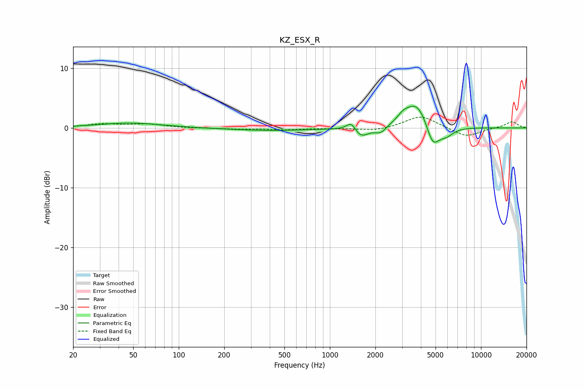

# KZ_ESX_R
See [usage instructions](https://github.com/jaakkopasanen/AutoEq#usage) for more options and info.

### Parametric EQs
Apply preamp of -3.7 dB when using parametric equalizer.

|   # | Type    |   Fc (Hz) |    Q |   Gain (dB) |
|-----|---------|-----------|------|-------------|
|   1 | Peaking |        48 | 0.67 |         0.8 |
|   2 | Peaking |       403 | 0.5  |        -0.4 |
|   3 | Peaking |      1388 | 4.4  |         1.6 |
|   4 | Peaking |      1596 | 2.83 |        -1.8 |
|   5 | Peaking |      2171 | 3.74 |        -1.2 |
|   6 | Peaking |      3044 | 4.6  |         0.7 |
|   7 | Peaking |      3633 | 1.7  |         3.5 |
|   8 | Peaking |      3930 | 2.26 |         1.2 |
|   9 | Peaking |      4787 | 3.28 |        -3.9 |
|  10 | Peaking |      5861 | 2.72 |        -1.4 |

### Fixed Band EQs
When using fixed band (also called graphic) equalizer, apply preamp of **-1.9 dB** (if available) and set gains manually with these parameters.

|   # | Type    |   Fc (Hz) |    Q |   Gain (dB) |
|-----|---------|-----------|------|-------------|
|   1 | Peaking |        31 | 1.41 |         0.6 |
|   2 | Peaking |        62 | 1.41 |         0.6 |
|   3 | Peaking |       125 | 1.41 |        -0.1 |
|   4 | Peaking |       250 | 1.41 |        -0.2 |
|   5 | Peaking |       500 | 1.41 |        -0.3 |
|   6 | Peaking |      1000 | 1.41 |        -0   |
|   7 | Peaking |      2000 | 1.41 |        -0.5 |
|   8 | Peaking |      4000 | 1.41 |         2.1 |
|   9 | Peaking |      8000 | 1.41 |        -1.5 |
|  10 | Peaking |     16000 | 1.41 |         1.1 |

### Graphs

