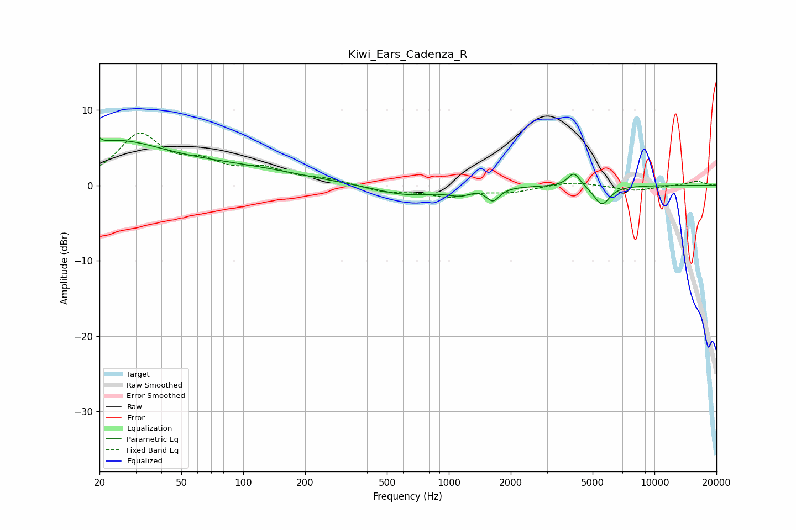

# Kiwi_Ears_Cadenza_R
See [usage instructions](https://github.com/jaakkopasanen/AutoEq#usage) for more options and info.

### Parametric EQs
Apply preamp of -6.4 dB when using parametric equalizer.

|   # | Type    |   Fc (Hz) |    Q |   Gain (dB) |
|-----|---------|-----------|------|-------------|
|   1 | Peaking |        20 | 6    |         5.3 |
|   2 | Peaking |        20 | 5.99 |        -4.7 |
|   3 | Peaking |        23 | 0.54 |         5.4 |
|   4 | Peaking |        97 | 0.46 |         1.9 |
|   5 | Peaking |       617 | 0.92 |        -1.3 |
|   6 | Peaking |      1161 | 2.2  |        -1.3 |
|   7 | Peaking |      1291 | 2.02 |         0.6 |
|   8 | Peaking |      1638 | 4.5  |        -1.8 |
|   9 | Peaking |      4057 | 4.66 |         1.9 |
|  10 | Peaking |      5546 | 3.65 |        -2.6 |

### Fixed Band EQs
When using fixed band (also called graphic) equalizer, apply preamp of **-7.0 dB** (if available) and set gains manually with these parameters.

|   # | Type    |   Fc (Hz) |    Q |   Gain (dB) |
|-----|---------|-----------|------|-------------|
|   1 | Peaking |        31 | 1.41 |         6.4 |
|   2 | Peaking |        62 | 1.41 |         2.3 |
|   3 | Peaking |       125 | 1.41 |         1.9 |
|   4 | Peaking |       250 | 1.41 |         0.7 |
|   5 | Peaking |       500 | 1.41 |        -0.9 |
|   6 | Peaking |      1000 | 1.41 |        -1.3 |
|   7 | Peaking |      2000 | 1.41 |        -0.8 |
|   8 | Peaking |      4000 | 1.41 |         0.6 |
|   9 | Peaking |      8000 | 1.41 |        -0.7 |
|  10 | Peaking |     16000 | 1.41 |         0.6 |

### Graphs

