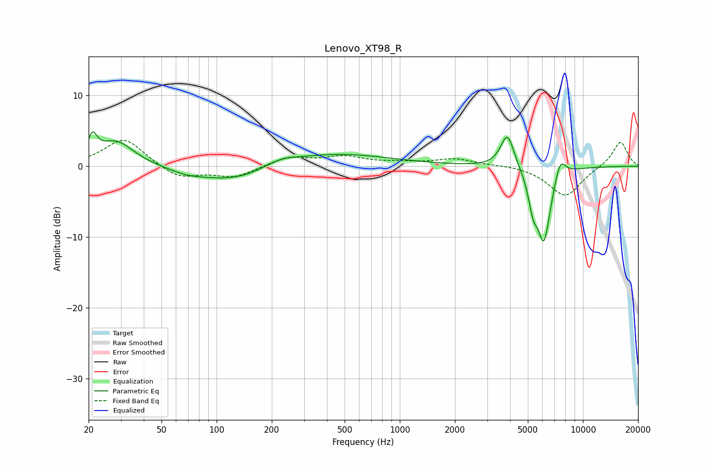

# Lenovo_XT98_R
See [usage instructions](https://github.com/jaakkopasanen/AutoEq#usage) for more options and info.

### Parametric EQs
Apply preamp of -5.0 dB when using parametric equalizer.

|   # | Type    |   Fc (Hz) |    Q |   Gain (dB) |
|-----|---------|-----------|------|-------------|
|   1 | Peaking |        21 | 5.91 |         2.9 |
|   2 | Peaking |        28 | 1.43 |         3.6 |
|   3 | Peaking |        68 | 1.63 |        -0.6 |
|   4 | Peaking |       124 | 0.69 |        -2.3 |
|   5 | Peaking |       224 | 1.53 |         0.9 |
|   6 | Peaking |       430 | 0.47 |         1.9 |
|   7 | Peaking |      3874 | 3.74 |         5   |
|   8 | Peaking |      5336 | 5.87 |        -3.6 |
|   9 | Peaking |      6117 | 3.51 |       -10.6 |
|  10 | Peaking |      7507 | 4.38 |         3   |

### Fixed Band EQs
When using fixed band (also called graphic) equalizer, apply preamp of **-3.7 dB** (if available) and set gains manually with these parameters.

|   # | Type    |   Fc (Hz) |    Q |   Gain (dB) |
|-----|---------|-----------|------|-------------|
|   1 | Peaking |        31 | 1.41 |         4   |
|   2 | Peaking |        62 | 1.41 |        -1.8 |
|   3 | Peaking |       125 | 1.41 |        -1.5 |
|   4 | Peaking |       250 | 1.41 |         1.3 |
|   5 | Peaking |       500 | 1.41 |         1.2 |
|   6 | Peaking |      1000 | 1.41 |         0.4 |
|   7 | Peaking |      2000 | 1.41 |         1   |
|   8 | Peaking |      4000 | 1.41 |         0.2 |
|   9 | Peaking |      8000 | 1.41 |        -4.3 |
|  10 | Peaking |     16000 | 1.41 |         3.6 |

### Graphs

