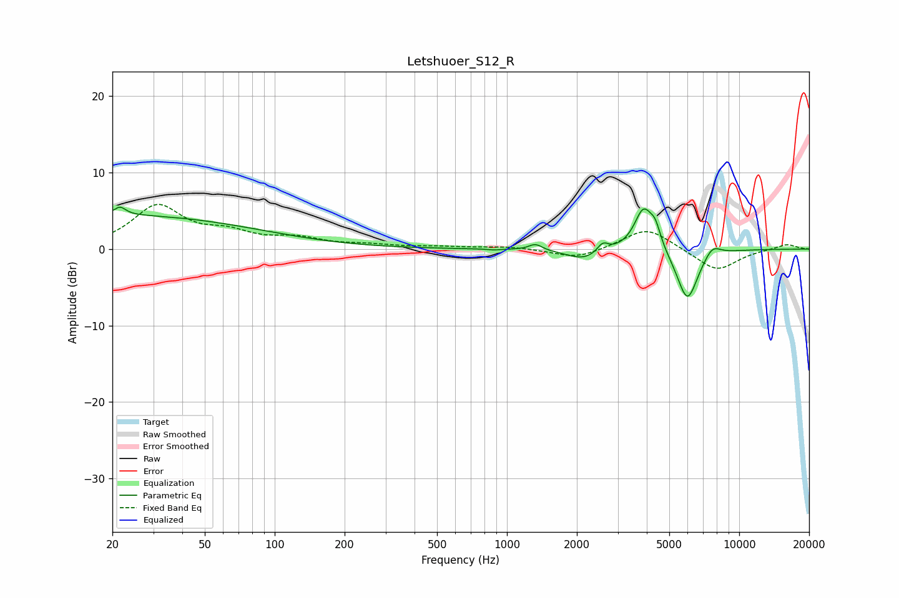

# Letshuoer_S12_R
See [usage instructions](https://github.com/jaakkopasanen/AutoEq#usage) for more options and info.

### Parametric EQs
Apply preamp of -5.6 dB when using parametric equalizer.

|   # | Type    |   Fc (Hz) |    Q |   Gain (dB) |
|-----|---------|-----------|------|-------------|
|   1 | Peaking |        20 | 0.21 |         4.4 |
|   2 | Peaking |        22 | 5.8  |         1.1 |
|   3 | Peaking |       875 | 5.59 |        -0.1 |
|   4 | Peaking |      1327 | 5.04 |         0.8 |
|   5 | Peaking |      2133 | 1.93 |        -1.4 |
|   6 | Peaking |      2587 | 6    |         1.2 |
|   7 | Peaking |      3873 | 3.51 |         5.4 |
|   8 | Peaking |      4357 | 6    |         2.2 |
|   9 | Peaking |      5983 | 2.99 |        -6.9 |
|  10 | Peaking |      7664 | 3.86 |         1.5 |

### Fixed Band EQs
When using fixed band (also called graphic) equalizer, apply preamp of **-5.9 dB** (if available) and set gains manually with these parameters.

|   # | Type    |   Fc (Hz) |    Q |   Gain (dB) |
|-----|---------|-----------|------|-------------|
|   1 | Peaking |        31 | 1.41 |         5.5 |
|   2 | Peaking |        62 | 1.41 |         1.7 |
|   3 | Peaking |       125 | 1.41 |         1.2 |
|   4 | Peaking |       250 | 1.41 |         0.4 |
|   5 | Peaking |       500 | 1.41 |         0.2 |
|   6 | Peaking |      1000 | 1.41 |         0.3 |
|   7 | Peaking |      2000 | 1.41 |        -1.3 |
|   8 | Peaking |      4000 | 1.41 |         2.9 |
|   9 | Peaking |      8000 | 1.41 |        -2.9 |
|  10 | Peaking |     16000 | 1.41 |         0.7 |

### Graphs

