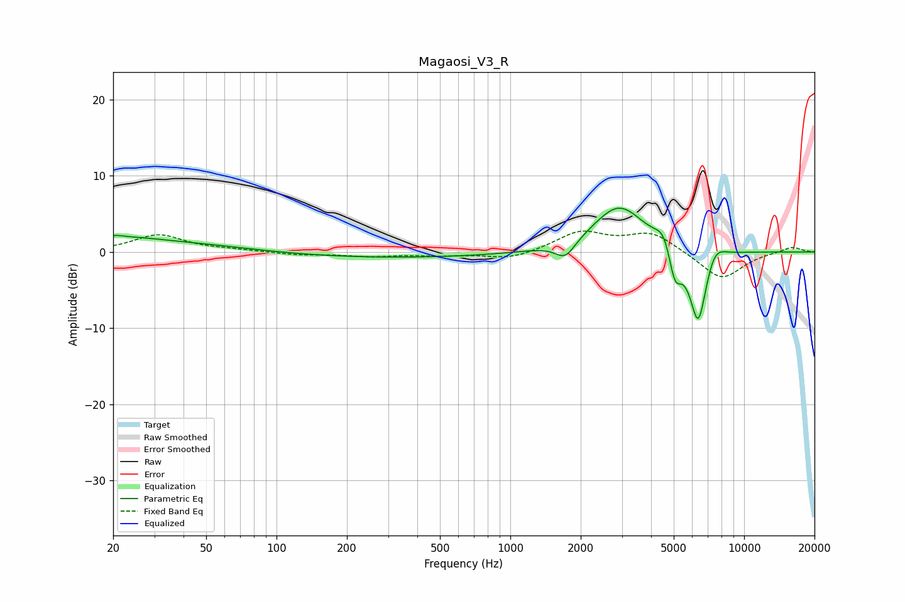

# Magaosi_V3_R
See [usage instructions](https://github.com/jaakkopasanen/AutoEq#usage) for more options and info.

### Parametric EQs
Apply preamp of -5.8 dB when using parametric equalizer.

|   # | Type    |   Fc (Hz) |    Q |   Gain (dB) |
|-----|---------|-----------|------|-------------|
|   1 | Peaking |        21 | 6    |         0.2 |
|   2 | Peaking |        21 | 0.82 |         1.4 |
|   3 | Peaking |        47 | 0.48 |         1.1 |
|   4 | Peaking |       230 | 0.21 |        -0.8 |
|   5 | Peaking |      1719 | 3.3  |        -2.2 |
|   6 | Peaking |      2921 | 1.25 |         6.2 |
|   7 | Peaking |      4540 | 4    |         2.4 |
|   8 | Peaking |      5058 | 5.04 |        -4.5 |
|   9 | Peaking |      6369 | 3.51 |       -10.5 |
|  10 | Peaking |      7436 | 3.02 |         2.6 |

### Fixed Band EQs
When using fixed band (also called graphic) equalizer, apply preamp of **-2.8 dB** (if available) and set gains manually with these parameters.

|   # | Type    |   Fc (Hz) |    Q |   Gain (dB) |
|-----|---------|-----------|------|-------------|
|   1 | Peaking |        31 | 1.41 |         2.2 |
|   2 | Peaking |        62 | 1.41 |         0.2 |
|   3 | Peaking |       125 | 1.41 |        -0.4 |
|   4 | Peaking |       250 | 1.41 |        -0.5 |
|   5 | Peaking |       500 | 1.41 |        -0.4 |
|   6 | Peaking |      1000 | 1.41 |        -1   |
|   7 | Peaking |      2000 | 1.41 |         2.6 |
|   8 | Peaking |      4000 | 1.41 |         2.5 |
|   9 | Peaking |      8000 | 1.41 |        -3.7 |
|  10 | Peaking |     16000 | 1.41 |         0.7 |

### Graphs

