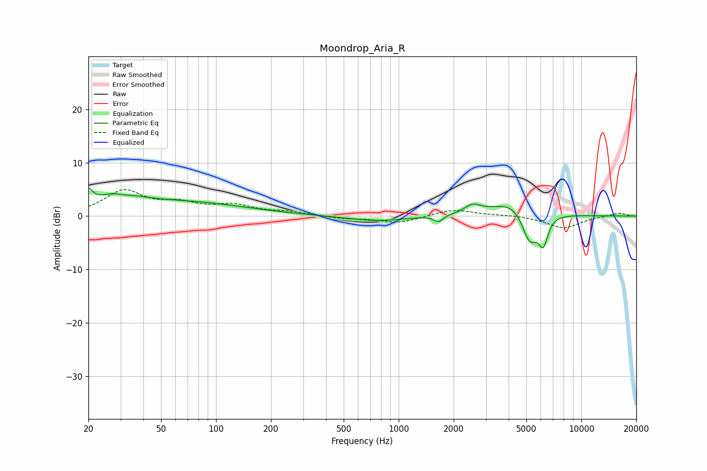

# Moondrop_Aria_R
See [usage instructions](https://github.com/jaakkopasanen/AutoEq#usage) for more options and info.

### Parametric EQs
Apply preamp of -5.3 dB when using parametric equalizer.

|   # | Type    |   Fc (Hz) |    Q |   Gain (dB) |
|-----|---------|-----------|------|-------------|
|   1 | Peaking |        20 | 6    |         2.7 |
|   2 | Peaking |        29 | 1.39 |         3.8 |
|   3 | Peaking |        31 | 2.32 |        -1.4 |
|   4 | Peaking |        66 | 0.42 |         2.5 |
|   5 | Peaking |       760 | 0.89 |        -1   |
|   6 | Peaking |      1651 | 5.75 |        -1.2 |
|   7 | Peaking |      2535 | 3.26 |         1.5 |
|   8 | Peaking |      4380 | 1.18 |         3.4 |
|   9 | Peaking |      5215 | 3.06 |        -6.6 |
|  10 | Peaking |      6191 | 5.38 |        -5   |

### Fixed Band EQs
When using fixed band (also called graphic) equalizer, apply preamp of **-5.1 dB** (if available) and set gains manually with these parameters.

|   # | Type    |   Fc (Hz) |    Q |   Gain (dB) |
|-----|---------|-----------|------|-------------|
|   1 | Peaking |        31 | 1.41 |         4.5 |
|   2 | Peaking |        62 | 1.41 |         1.9 |
|   3 | Peaking |       125 | 1.41 |         1.8 |
|   4 | Peaking |       250 | 1.41 |         0.7 |
|   5 | Peaking |       500 | 1.41 |        -0.5 |
|   6 | Peaking |      1000 | 1.41 |        -1.3 |
|   7 | Peaking |      2000 | 1.41 |         1.3 |
|   8 | Peaking |      4000 | 1.41 |         0.2 |
|   9 | Peaking |      8000 | 1.41 |        -2.3 |
|  10 | Peaking |     16000 | 1.41 |         0.6 |

### Graphs

