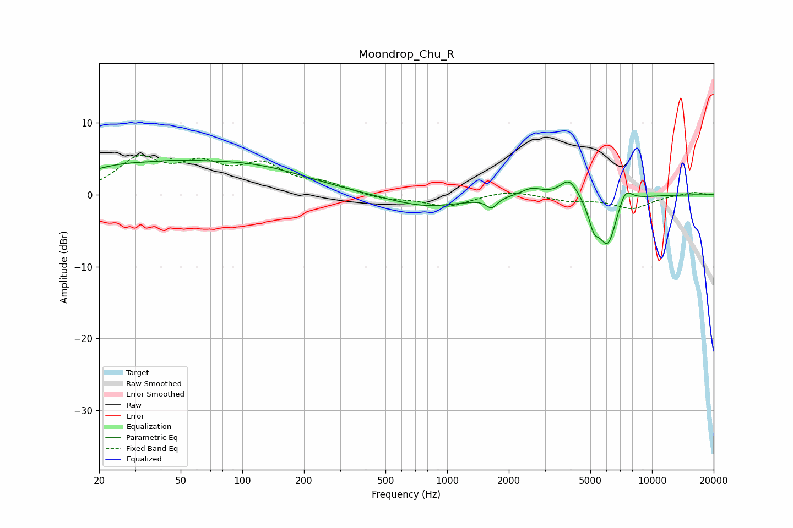

# Moondrop_Chu_R
See [usage instructions](https://github.com/jaakkopasanen/AutoEq#usage) for more options and info.

### Parametric EQs
Apply preamp of -4.9 dB when using parametric equalizer.

|   # | Type    |   Fc (Hz) |    Q |   Gain (dB) |
|-----|---------|-----------|------|-------------|
|   1 | Peaking |        32 | 0.49 |         4.3 |
|   2 | Peaking |        35 | 1.25 |        -0.6 |
|   3 | Peaking |       117 | 0.51 |         3.1 |
|   4 | Peaking |       787 | 0.75 |        -1.8 |
|   5 | Peaking |      1647 | 5.47 |        -1.3 |
|   6 | Peaking |      2580 | 2.63 |         1.1 |
|   7 | Peaking |      3947 | 3.18 |         2.6 |
|   8 | Peaking |      5206 | 5.2  |        -3   |
|   9 | Peaking |      6085 | 3.05 |        -6.9 |
|  10 | Peaking |      7386 | 3.9  |         2.4 |

### Fixed Band EQs
When using fixed band (also called graphic) equalizer, apply preamp of **-5.5 dB** (if available) and set gains manually with these parameters.

|   # | Type    |   Fc (Hz) |    Q |   Gain (dB) |
|-----|---------|-----------|------|-------------|
|   1 | Peaking |        31 | 1.41 |         4.6 |
|   2 | Peaking |        62 | 1.41 |         3.5 |
|   3 | Peaking |       125 | 1.41 |         3.7 |
|   4 | Peaking |       250 | 1.41 |         1.3 |
|   5 | Peaking |       500 | 1.41 |        -0.7 |
|   6 | Peaking |      1000 | 1.41 |        -1.6 |
|   7 | Peaking |      2000 | 1.41 |         0.7 |
|   8 | Peaking |      4000 | 1.41 |        -0.8 |
|   9 | Peaking |      8000 | 1.41 |        -1.8 |
|  10 | Peaking |     16000 | 1.41 |         0.4 |

### Graphs

