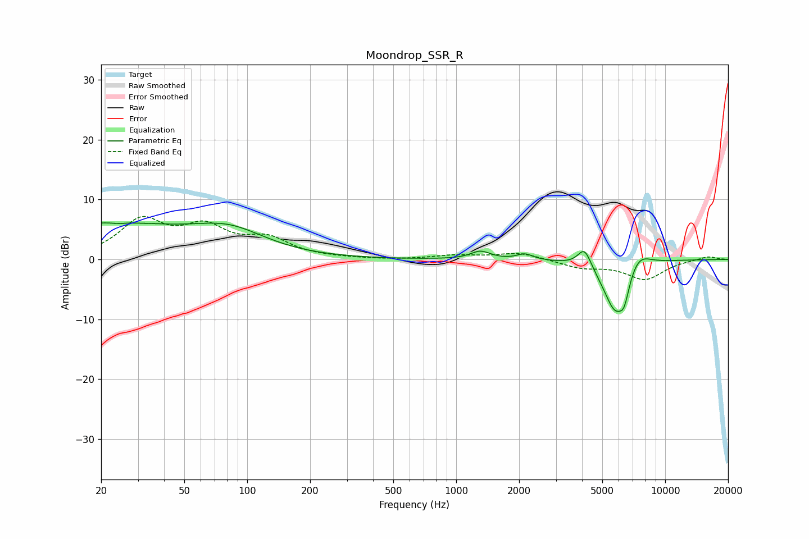

# Moondrop_SSR_R
See [usage instructions](https://github.com/jaakkopasanen/AutoEq#usage) for more options and info.

### Parametric EQs
Apply preamp of -6.2 dB when using parametric equalizer.

|   # | Type    |   Fc (Hz) |    Q |   Gain (dB) |
|-----|---------|-----------|------|-------------|
|   1 | Peaking |        20 | 5.39 |         0.1 |
|   2 | Peaking |        21 | 0.36 |         5.7 |
|   3 | Peaking |        24 | 5.75 |        -0.2 |
|   4 | Peaking |        82 | 0.8  |         3.7 |
|   5 | Peaking |      1307 | 3.06 |         1.3 |
|   6 | Peaking |      2132 | 3.78 |         1   |
|   7 | Peaking |      4113 | 4.35 |         3.3 |
|   8 | Peaking |      5766 | 2.32 |        -8.7 |
|   9 | Peaking |      6373 | 5.96 |        -3   |
|  10 | Peaking |      7422 | 2.38 |         2.9 |

### Fixed Band EQs
When using fixed band (also called graphic) equalizer, apply preamp of **-7.3 dB** (if available) and set gains manually with these parameters.

|   # | Type    |   Fc (Hz) |    Q |   Gain (dB) |
|-----|---------|-----------|------|-------------|
|   1 | Peaking |        31 | 1.41 |         6.2 |
|   2 | Peaking |        62 | 1.41 |         4.7 |
|   3 | Peaking |       125 | 1.41 |         3   |
|   4 | Peaking |       250 | 1.41 |         0.1 |
|   5 | Peaking |       500 | 1.41 |        -0.1 |
|   6 | Peaking |      1000 | 1.41 |         0.6 |
|   7 | Peaking |      2000 | 1.41 |         1.1 |
|   8 | Peaking |      4000 | 1.41 |        -1.3 |
|   9 | Peaking |      8000 | 1.41 |        -3.2 |
|  10 | Peaking |     16000 | 1.41 |         0.6 |

### Graphs

