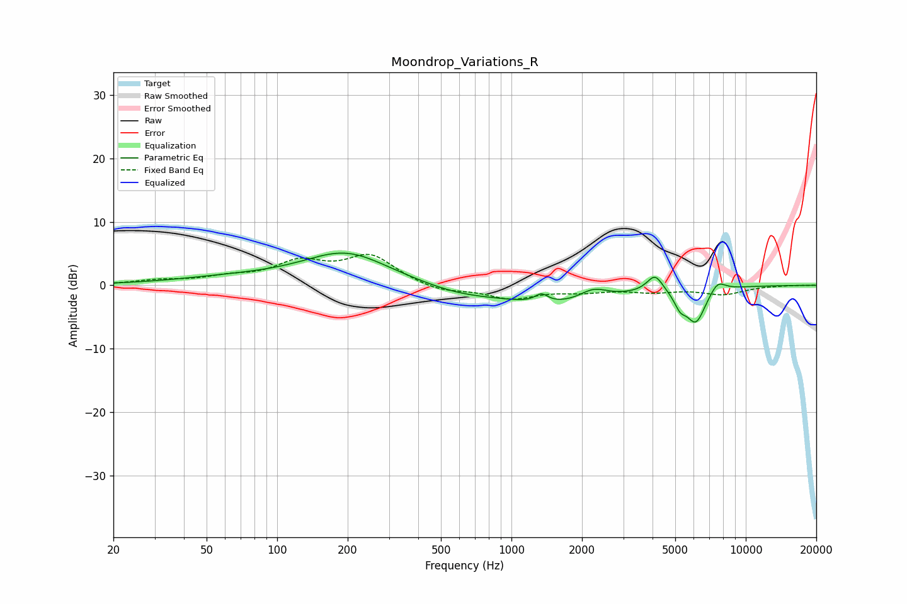

# Moondrop_Variations_R
See [usage instructions](https://github.com/jaakkopasanen/AutoEq#usage) for more options and info.

### Parametric EQs
Apply preamp of -5.2 dB when using parametric equalizer.

|   # | Type    |   Fc (Hz) |    Q |   Gain (dB) |
|-----|---------|-----------|------|-------------|
|   1 | Peaking |        63 | 0.57 |         1   |
|   2 | Peaking |       197 | 0.77 |         5.1 |
|   3 | Peaking |       595 | 0.85 |        -1.2 |
|   4 | Peaking |      1343 | 5.2  |         1.3 |
|   5 | Peaking |      1587 | 0.62 |        -2.9 |
|   6 | Peaking |      2237 | 2.34 |         1.7 |
|   7 | Peaking |      4099 | 4.1  |         2.8 |
|   8 | Peaking |      5250 | 5.5  |        -2   |
|   9 | Peaking |      6124 | 3.28 |        -5.5 |
|  10 | Peaking |      7586 | 4.05 |         1.8 |

### Fixed Band EQs
When using fixed band (also called graphic) equalizer, apply preamp of **-5.0 dB** (if available) and set gains manually with these parameters.

|   # | Type    |   Fc (Hz) |    Q |   Gain (dB) |
|-----|---------|-----------|------|-------------|
|   1 | Peaking |        31 | 1.41 |         0.7 |
|   2 | Peaking |        62 | 1.41 |         1   |
|   3 | Peaking |       125 | 1.41 |         3.3 |
|   4 | Peaking |       250 | 1.41 |         4.5 |
|   5 | Peaking |       500 | 1.41 |        -1.1 |
|   6 | Peaking |      1000 | 1.41 |        -2   |
|   7 | Peaking |      2000 | 1.41 |        -0.8 |
|   8 | Peaking |      4000 | 1.41 |        -0.9 |
|   9 | Peaking |      8000 | 1.41 |        -1.3 |
|  10 | Peaking |     16000 | 1.41 |         0   |

### Graphs

