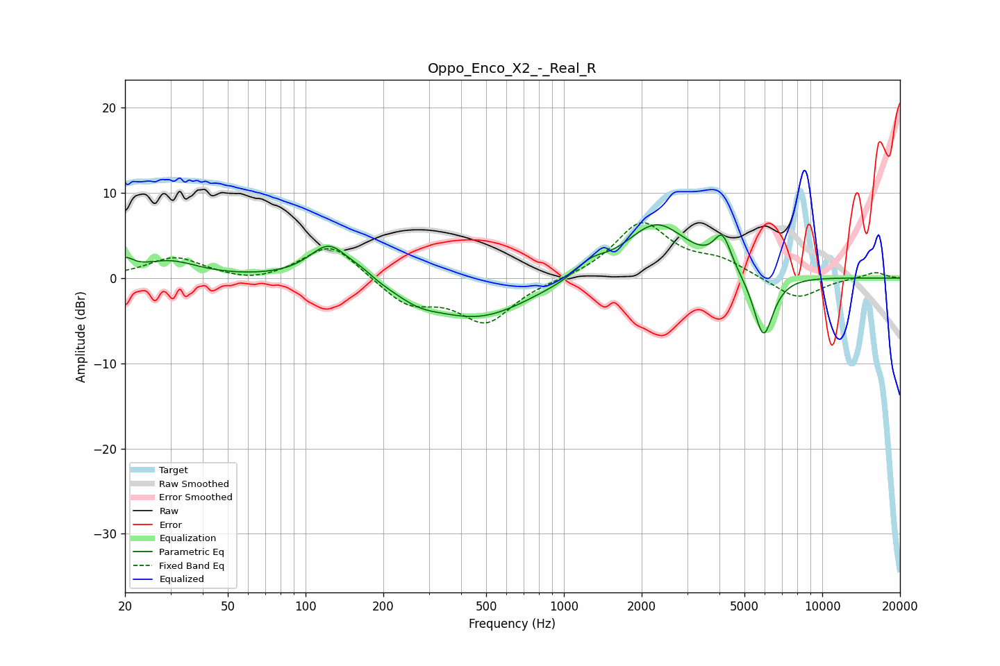

# Oppo_Enco_X2_-_Real_R
See [usage instructions](https://github.com/jaakkopasanen/AutoEq#usage) for more options and info.

### Parametric EQs
Apply preamp of -6.3 dB when using parametric equalizer.

|   # | Type    |   Fc (Hz) |    Q |   Gain (dB) |
|-----|---------|-----------|------|-------------|
|   1 | Peaking |        20 | 4.5  |         1.5 |
|   2 | Peaking |        30 | 1.29 |         1.9 |
|   3 | Peaking |       124 | 1.81 |         4.3 |
|   4 | Peaking |       165 | 3.01 |         0.6 |
|   5 | Peaking |       273 | 1.72 |        -1.1 |
|   6 | Peaking |       467 | 0.7  |        -4.6 |
|   7 | Peaking |      1270 | 2.48 |         1.4 |
|   8 | Peaking |      2280 | 1.13 |         6.5 |
|   9 | Peaking |      4110 | 4.2  |         3.9 |
|  10 | Peaking |      5918 | 3.5  |        -7.6 |

### Fixed Band EQs
When using fixed band (also called graphic) equalizer, apply preamp of **-6.6 dB** (if available) and set gains manually with these parameters.

|   # | Type    |   Fc (Hz) |    Q |   Gain (dB) |
|-----|---------|-----------|------|-------------|
|   1 | Peaking |        31 | 1.41 |         2.4 |
|   2 | Peaking |        62 | 1.41 |        -0.7 |
|   3 | Peaking |       125 | 1.41 |         4.2 |
|   4 | Peaking |       250 | 1.41 |        -3   |
|   5 | Peaking |       500 | 1.41 |        -5.1 |
|   6 | Peaking |      1000 | 1.41 |        -0.1 |
|   7 | Peaking |      2000 | 1.41 |         6.5 |
|   8 | Peaking |      4000 | 1.41 |         1.8 |
|   9 | Peaking |      8000 | 1.41 |        -2.6 |
|  10 | Peaking |     16000 | 1.41 |         0.7 |

### Graphs

