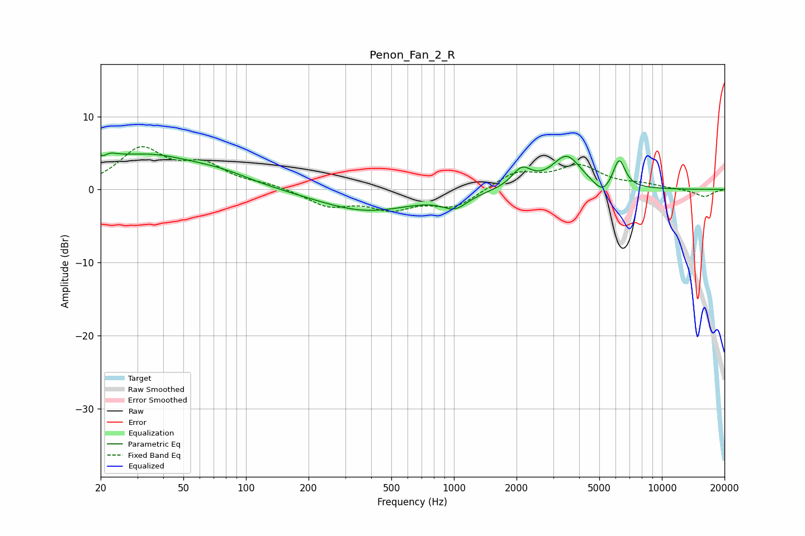

# Penon_Fan_2_R
See [usage instructions](https://github.com/jaakkopasanen/AutoEq#usage) for more options and info.

### Parametric EQs
Apply preamp of -5.1 dB when using parametric equalizer.

|   # | Type    |   Fc (Hz) |    Q |   Gain (dB) |
|-----|---------|-----------|------|-------------|
|   1 | Peaking |        20 | 3.45 |         4.7 |
|   2 | Peaking |        20 | 5.25 |        -3.3 |
|   3 | Peaking |        33 | 0.58 |         4.4 |
|   4 | Peaking |        77 | 0.95 |         1.1 |
|   5 | Peaking |       378 | 0.61 |        -3   |
|   6 | Peaking |      1011 | 2.29 |        -1.9 |
|   7 | Peaking |      2118 | 2.98 |         2.6 |
|   8 | Peaking |      3485 | 1.99 |         4.5 |
|   9 | Peaking |      5194 | 3.21 |        -1.7 |
|  10 | Peaking |      6226 | 4.66 |         4   |

### Fixed Band EQs
When using fixed band (also called graphic) equalizer, apply preamp of **-6.0 dB** (if available) and set gains manually with these parameters.

|   # | Type    |   Fc (Hz) |    Q |   Gain (dB) |
|-----|---------|-----------|------|-------------|
|   1 | Peaking |        31 | 1.41 |         5.3 |
|   2 | Peaking |        62 | 1.41 |         3   |
|   3 | Peaking |       125 | 1.41 |         0.6 |
|   4 | Peaking |       250 | 1.41 |        -2.2 |
|   5 | Peaking |       500 | 1.41 |        -2.3 |
|   6 | Peaking |      1000 | 1.41 |        -2.4 |
|   7 | Peaking |      2000 | 1.41 |         2.3 |
|   8 | Peaking |      4000 | 1.41 |         3   |
|   9 | Peaking |      8000 | 1.41 |         0.6 |
|  10 | Peaking |     16000 | 1.41 |        -1   |

### Graphs

