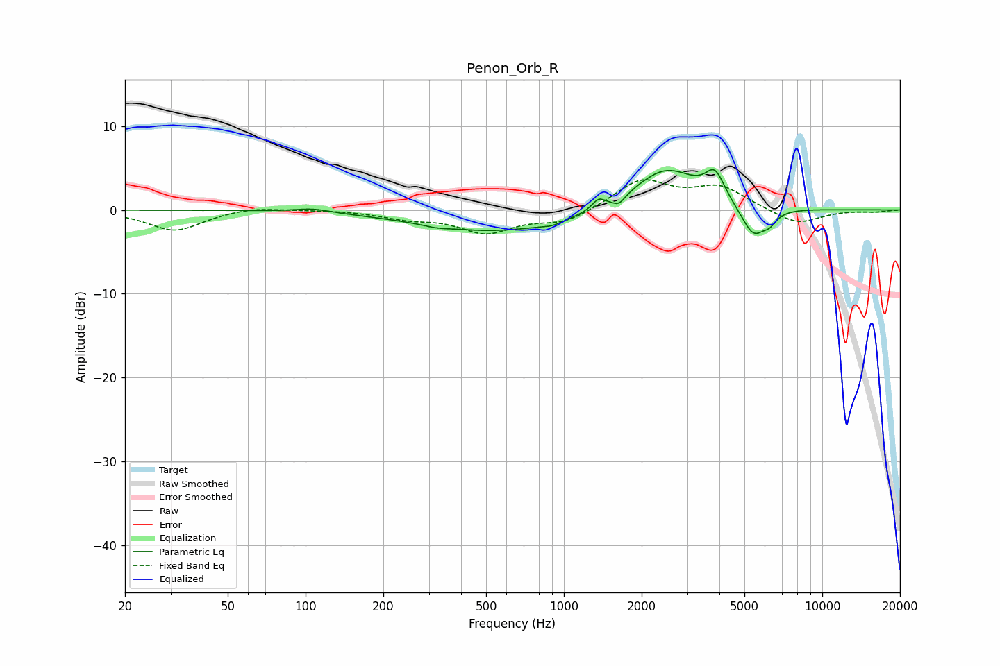

# Penon_Orb_R
See [usage instructions](https://github.com/jaakkopasanen/AutoEq#usage) for more options and info.

### Parametric EQs
Apply preamp of -4.9 dB when using parametric equalizer.

|   # | Type    |   Fc (Hz) |    Q |   Gain (dB) |
|-----|---------|-----------|------|-------------|
|   1 | Peaking |       107 | 2.11 |         0.5 |
|   2 | Peaking |       321 | 3.22 |        -0.2 |
|   3 | Peaking |       551 | 0.49 |        -2.6 |
|   4 | Peaking |       901 | 3.18 |        -0.4 |
|   5 | Peaking |      1362 | 5.99 |         1.1 |
|   6 | Peaking |      1634 | 6    |        -1   |
|   7 | Peaking |      2481 | 1.12 |         5.1 |
|   8 | Peaking |      3846 | 3.85 |         3.2 |
|   9 | Peaking |      5421 | 2.88 |        -3.8 |
|  10 | Peaking |      6275 | 5.71 |        -1   |

### Fixed Band EQs
When using fixed band (also called graphic) equalizer, apply preamp of **-3.7 dB** (if available) and set gains manually with these parameters.

|   # | Type    |   Fc (Hz) |    Q |   Gain (dB) |
|-----|---------|-----------|------|-------------|
|   1 | Peaking |        31 | 1.41 |        -2.5 |
|   2 | Peaking |        62 | 1.41 |         0.5 |
|   3 | Peaking |       125 | 1.41 |         0.1 |
|   4 | Peaking |       250 | 1.41 |        -0.9 |
|   5 | Peaking |       500 | 1.41 |        -2.6 |
|   6 | Peaking |      1000 | 1.41 |        -1.5 |
|   7 | Peaking |      2000 | 1.41 |         3.5 |
|   8 | Peaking |      4000 | 1.41 |         2.6 |
|   9 | Peaking |      8000 | 1.41 |        -1.8 |
|  10 | Peaking |     16000 | 1.41 |        -0.2 |

### Graphs

