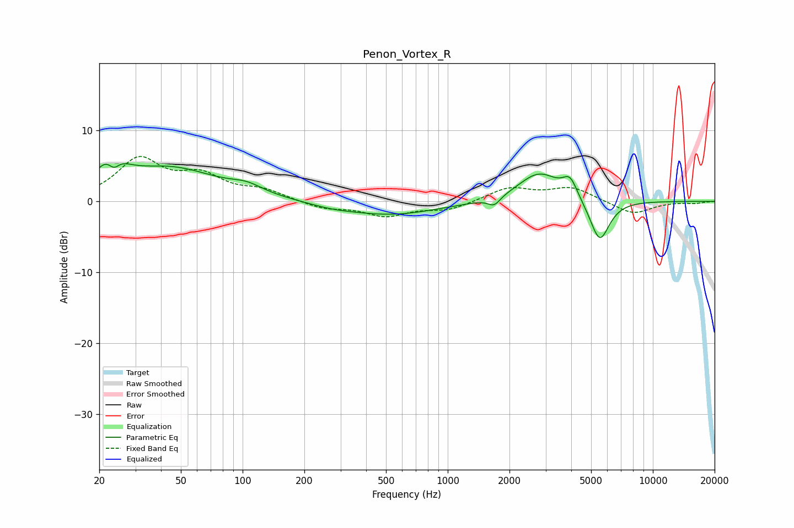

# Penon_Vortex_R
See [usage instructions](https://github.com/jaakkopasanen/AutoEq#usage) for more options and info.

### Parametric EQs
Apply preamp of -5.4 dB when using parametric equalizer.

|   # | Type    |   Fc (Hz) |    Q |   Gain (dB) |
|-----|---------|-----------|------|-------------|
|   1 | Peaking |        23 | 2.35 |         4.9 |
|   2 | Peaking |        23 | 4.59 |        -2.8 |
|   3 | Peaking |        44 | 0.6  |         4.5 |
|   4 | Peaking |       105 | 1.83 |         1.1 |
|   5 | Peaking |       270 | 1.37 |        -0.4 |
|   6 | Peaking |       525 | 0.61 |        -1.9 |
|   7 | Peaking |      1684 | 4.71 |        -1.2 |
|   8 | Peaking |      2788 | 1.39 |         4.1 |
|   9 | Peaking |      3948 | 4    |         2.6 |
|  10 | Peaking |      5506 | 2.89 |        -6   |

### Fixed Band EQs
When using fixed band (also called graphic) equalizer, apply preamp of **-6.4 dB** (if available) and set gains manually with these parameters.

|   # | Type    |   Fc (Hz) |    Q |   Gain (dB) |
|-----|---------|-----------|------|-------------|
|   1 | Peaking |        31 | 1.41 |         5.7 |
|   2 | Peaking |        62 | 1.41 |         3.1 |
|   3 | Peaking |       125 | 1.41 |         1.4 |
|   4 | Peaking |       250 | 1.41 |        -1   |
|   5 | Peaking |       500 | 1.41 |        -1.9 |
|   6 | Peaking |      1000 | 1.41 |        -1.2 |
|   7 | Peaking |      2000 | 1.41 |         1.9 |
|   8 | Peaking |      4000 | 1.41 |         1.9 |
|   9 | Peaking |      8000 | 1.41 |        -1.8 |
|  10 | Peaking |     16000 | 1.41 |        -0.2 |

### Graphs

