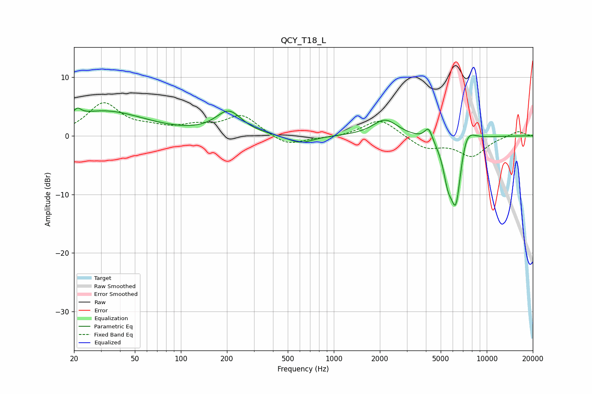

# QCY_T18_L
See [usage instructions](https://github.com/jaakkopasanen/AutoEq#usage) for more options and info.

### Parametric EQs
Apply preamp of -4.8 dB when using parametric equalizer.

|   # | Type    |   Fc (Hz) |    Q |   Gain (dB) |
|-----|---------|-----------|------|-------------|
|   1 | Peaking |        21 | 5.95 |         1.2 |
|   2 | Peaking |        31 | 0.52 |         4.2 |
|   3 | Peaking |       203 | 2.01 |        -0.1 |
|   4 | Peaking |       206 | 1.66 |         4   |
|   5 | Peaking |       604 | 1.65 |        -1.4 |
|   6 | Peaking |      2167 | 1.75 |         2.8 |
|   7 | Peaking |      4162 | 5.56 |         2.3 |
|   8 | Peaking |      5565 | 4.83 |        -4.1 |
|   9 | Peaking |      6290 | 3.29 |       -13.1 |
|  10 | Peaking |      7259 | 2.47 |         4.7 |

### Fixed Band EQs
When using fixed band (also called graphic) equalizer, apply preamp of **-5.8 dB** (if available) and set gains manually with these parameters.

|   # | Type    |   Fc (Hz) |    Q |   Gain (dB) |
|-----|---------|-----------|------|-------------|
|   1 | Peaking |        31 | 1.41 |         5.4 |
|   2 | Peaking |        62 | 1.41 |         1   |
|   3 | Peaking |       125 | 1.41 |         1.3 |
|   4 | Peaking |       250 | 1.41 |         3.4 |
|   5 | Peaking |       500 | 1.41 |        -1.8 |
|   6 | Peaking |      1000 | 1.41 |        -0.3 |
|   7 | Peaking |      2000 | 1.41 |         3   |
|   8 | Peaking |      4000 | 1.41 |        -2.1 |
|   9 | Peaking |      8000 | 1.41 |        -3.4 |
|  10 | Peaking |     16000 | 1.41 |         0.9 |

### Graphs

