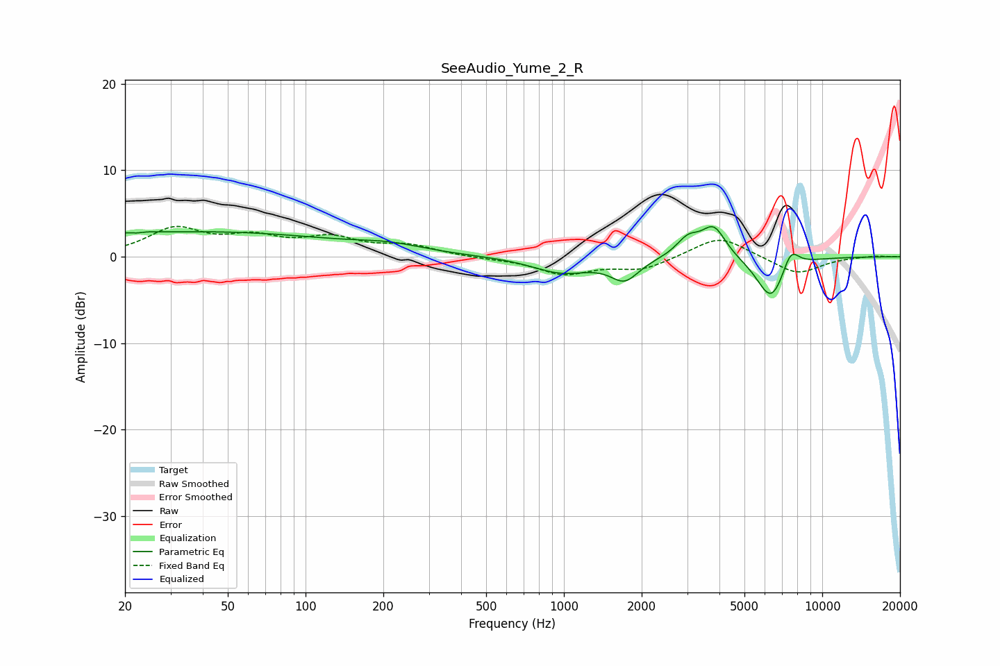

# SeeAudio_Yume_2_R
See [usage instructions](https://github.com/jaakkopasanen/AutoEq#usage) for more options and info.

### Parametric EQs
Apply preamp of -3.6 dB when using parametric equalizer.

|   # | Type    |   Fc (Hz) |    Q |   Gain (dB) |
|-----|---------|-----------|------|-------------|
|   1 | Peaking |        22 | 3.66 |         2.7 |
|   2 | Peaking |        22 | 4.07 |        -2.6 |
|   3 | Peaking |        40 | 0.26 |         2.8 |
|   4 | Peaking |       212 | 1.12 |         0.7 |
|   5 | Peaking |       982 | 1.22 |        -1.8 |
|   6 | Peaking |      1719 | 2.6  |        -2.4 |
|   7 | Peaking |      3022 | 3.09 |         2   |
|   8 | Peaking |      3802 | 2.98 |         3.5 |
|   9 | Peaking |      6350 | 2.44 |        -5.1 |
|  10 | Peaking |      7548 | 4.16 |         2.5 |

### Fixed Band EQs
When using fixed band (also called graphic) equalizer, apply preamp of **-3.6 dB** (if available) and set gains manually with these parameters.

|   # | Type    |   Fc (Hz) |    Q |   Gain (dB) |
|-----|---------|-----------|------|-------------|
|   1 | Peaking |        31 | 1.41 |         3.1 |
|   2 | Peaking |        62 | 1.41 |         1.9 |
|   3 | Peaking |       125 | 1.41 |         1.9 |
|   4 | Peaking |       250 | 1.41 |         1.2 |
|   5 | Peaking |       500 | 1.41 |        -0.2 |
|   6 | Peaking |      1000 | 1.41 |        -1.9 |
|   7 | Peaking |      2000 | 1.41 |        -1.4 |
|   8 | Peaking |      4000 | 1.41 |         2.5 |
|   9 | Peaking |      8000 | 1.41 |        -2.1 |
|  10 | Peaking |     16000 | 1.41 |         0.1 |

### Graphs

