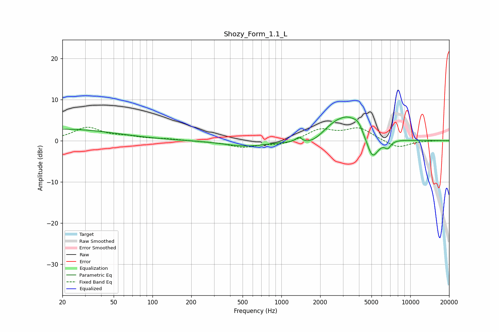

# Shozy_Form_1.1_L
See [usage instructions](https://github.com/jaakkopasanen/AutoEq#usage) for more options and info.

### Parametric EQs
Apply preamp of -5.8 dB when using parametric equalizer.

|   # | Type    |   Fc (Hz) |    Q |   Gain (dB) |
|-----|---------|-----------|------|-------------|
|   1 | Peaking |        20 | 0.34 |         2.8 |
|   2 | Peaking |       532 | 0.85 |        -1.4 |
|   3 | Peaking |      1364 | 5.74 |         1.2 |
|   4 | Peaking |      1685 | 1.43 |        -1.6 |
|   5 | Peaking |      2324 | 2.34 |         1   |
|   6 | Peaking |      2659 | 5.97 |         0.2 |
|   7 | Peaking |      3204 | 1.24 |         6   |
|   8 | Peaking |      3949 | 3.81 |         1.7 |
|   9 | Peaking |      5078 | 2.86 |        -5.9 |
|  10 | Peaking |      6683 | 5.72 |        -1.7 |

### Fixed Band EQs
When using fixed band (also called graphic) equalizer, apply preamp of **-3.4 dB** (if available) and set gains manually with these parameters.

|   # | Type    |   Fc (Hz) |    Q |   Gain (dB) |
|-----|---------|-----------|------|-------------|
|   1 | Peaking |        31 | 1.41 |         3.1 |
|   2 | Peaking |        62 | 1.41 |         0.8 |
|   3 | Peaking |       125 | 1.41 |         0.4 |
|   4 | Peaking |       250 | 1.41 |        -0.1 |
|   5 | Peaking |       500 | 1.41 |        -1.5 |
|   6 | Peaking |      1000 | 1.41 |        -1   |
|   7 | Peaking |      2000 | 1.41 |         2.6 |
|   8 | Peaking |      4000 | 1.41 |         2.9 |
|   9 | Peaking |      8000 | 1.41 |        -1.9 |
|  10 | Peaking |     16000 | 1.41 |         0   |

### Graphs

