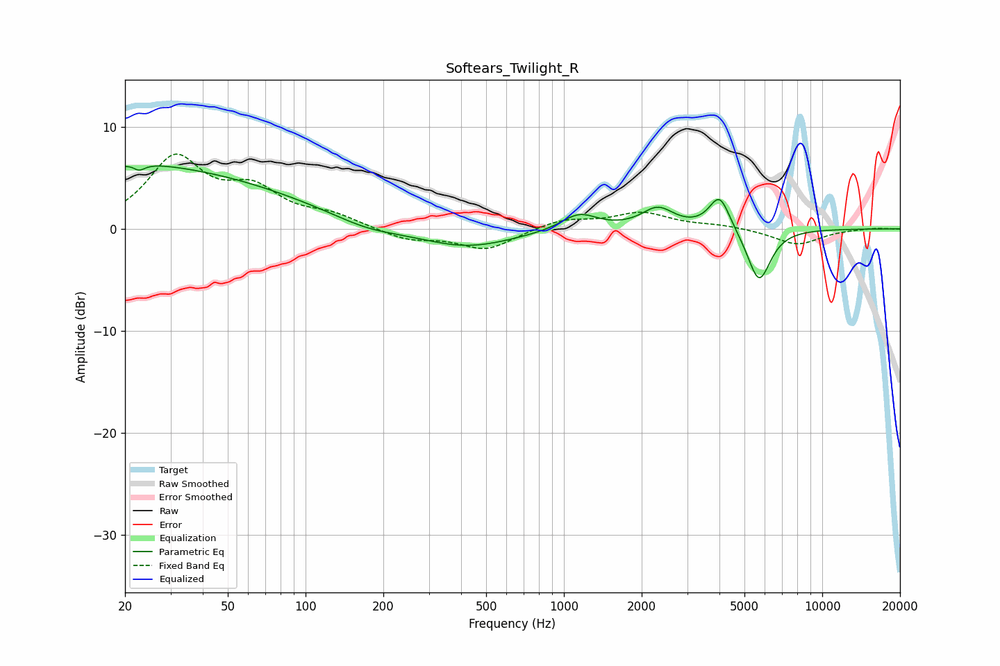

# Softears_Twilight_R
See [usage instructions](https://github.com/jaakkopasanen/AutoEq#usage) for more options and info.

### Parametric EQs
Apply preamp of -6.3 dB when using parametric equalizer.

|   # | Type    |   Fc (Hz) |    Q |   Gain (dB) |
|-----|---------|-----------|------|-------------|
|   1 | Peaking |        20 | 0.8  |         1.1 |
|   2 | Peaking |        22 | 5.74 |         2.8 |
|   3 | Peaking |        22 | 5.91 |        -3.3 |
|   4 | Peaking |        29 | 0.28 |         5.4 |
|   5 | Peaking |       173 | 1.1  |        -0.8 |
|   6 | Peaking |       418 | 0.77 |        -1.9 |
|   7 | Peaking |      1145 | 2.03 |         1.6 |
|   8 | Peaking |      2310 | 2.29 |         2   |
|   9 | Peaking |      4007 | 3.48 |         3.4 |
|  10 | Peaking |      5691 | 3.07 |        -5.3 |

### Fixed Band EQs
When using fixed band (also called graphic) equalizer, apply preamp of **-7.4 dB** (if available) and set gains manually with these parameters.

|   # | Type    |   Fc (Hz) |    Q |   Gain (dB) |
|-----|---------|-----------|------|-------------|
|   1 | Peaking |        31 | 1.41 |         6.7 |
|   2 | Peaking |        62 | 1.41 |         3.3 |
|   3 | Peaking |       125 | 1.41 |         1.1 |
|   4 | Peaking |       250 | 1.41 |        -1.1 |
|   5 | Peaking |       500 | 1.41 |        -2   |
|   6 | Peaking |      1000 | 1.41 |         0.9 |
|   7 | Peaking |      2000 | 1.41 |         1.5 |
|   8 | Peaking |      4000 | 1.41 |         0.3 |
|   9 | Peaking |      8000 | 1.41 |        -1.6 |
|  10 | Peaking |     16000 | 1.41 |         0.1 |

### Graphs

