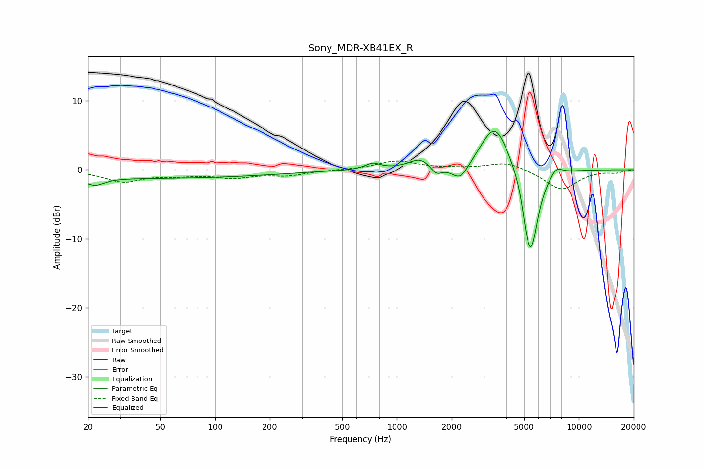

# Sony_MDR-XB41EX_R
See [usage instructions](https://github.com/jaakkopasanen/AutoEq#usage) for more options and info.

### Parametric EQs
Apply preamp of -5.6 dB when using parametric equalizer.

|   # | Type    |   Fc (Hz) |    Q |   Gain (dB) |
|-----|---------|-----------|------|-------------|
|   1 | Peaking |        22 | 2.82 |        -1.1 |
|   2 | Peaking |        43 | 0.18 |        -1.2 |
|   3 | Peaking |       736 | 3.52 |         0.9 |
|   4 | Peaking |      1346 | 2.34 |         1.5 |
|   5 | Peaking |      1641 | 4.45 |        -1.3 |
|   6 | Peaking |      2233 | 2.94 |        -2.5 |
|   7 | Peaking |      3452 | 1.79 |         6.9 |
|   8 | Peaking |      5171 | 6    |        -3   |
|   9 | Peaking |      5506 | 3.4  |       -11   |
|  10 | Peaking |      7520 | 4.06 |         1.3 |

### Fixed Band EQs
When using fixed band (also called graphic) equalizer, apply preamp of **-1.4 dB** (if available) and set gains manually with these parameters.

|   # | Type    |   Fc (Hz) |    Q |   Gain (dB) |
|-----|---------|-----------|------|-------------|
|   1 | Peaking |        31 | 1.41 |        -1.7 |
|   2 | Peaking |        62 | 1.41 |        -0.6 |
|   3 | Peaking |       125 | 1.41 |        -1   |
|   4 | Peaking |       250 | 1.41 |        -0.7 |
|   5 | Peaking |       500 | 1.41 |         0   |
|   6 | Peaking |      1000 | 1.41 |         1.3 |
|   7 | Peaking |      2000 | 1.41 |         0.1 |
|   8 | Peaking |      4000 | 1.41 |         1.2 |
|   9 | Peaking |      8000 | 1.41 |        -2.9 |
|  10 | Peaking |     16000 | 1.41 |        -0.4 |

### Graphs

