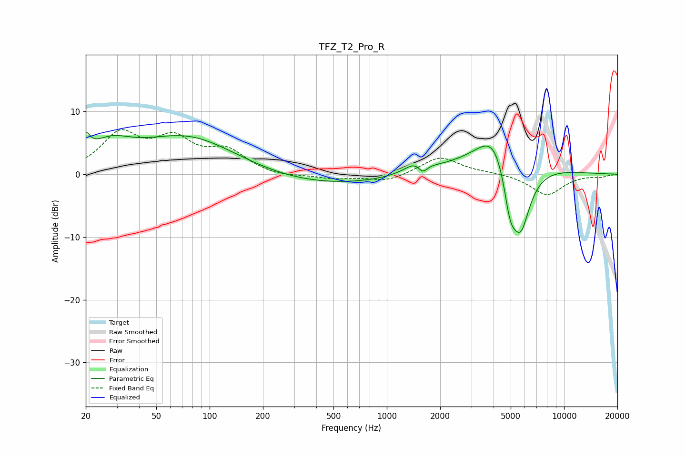

# TFZ_T2_Pro_R
See [usage instructions](https://github.com/jaakkopasanen/AutoEq#usage) for more options and info.

### Parametric EQs
Apply preamp of -6.7 dB when using parametric equalizer.

|   # | Type    |   Fc (Hz) |    Q |   Gain (dB) |
|-----|---------|-----------|------|-------------|
|   1 | Peaking |        20 | 5.89 |         2.9 |
|   2 | Peaking |        27 | 1.22 |         3.2 |
|   3 | Peaking |        77 | 0.46 |         7.6 |
|   4 | Peaking |       223 | 0.21 |        -2.5 |
|   5 | Peaking |      1476 | 2.33 |         1.9 |
|   6 | Peaking |      1592 | 5.15 |        -1.7 |
|   7 | Peaking |      4071 | 1.55 |         5.4 |
|   8 | Peaking |      4260 | 0.56 |         2.9 |
|   9 | Peaking |      4965 | 3.7  |        -6.5 |
|  10 | Peaking |      5696 | 2.31 |       -11.1 |

### Fixed Band EQs
When using fixed band (also called graphic) equalizer, apply preamp of **-7.2 dB** (if available) and set gains manually with these parameters.

|   # | Type    |   Fc (Hz) |    Q |   Gain (dB) |
|-----|---------|-----------|------|-------------|
|   1 | Peaking |        31 | 1.41 |         6   |
|   2 | Peaking |        62 | 1.41 |         4.9 |
|   3 | Peaking |       125 | 1.41 |         3.4 |
|   4 | Peaking |       250 | 1.41 |        -0.5 |
|   5 | Peaking |       500 | 1.41 |        -0.7 |
|   6 | Peaking |      1000 | 1.41 |        -1.2 |
|   7 | Peaking |      2000 | 1.41 |         2.8 |
|   8 | Peaking |      4000 | 1.41 |         0.2 |
|   9 | Peaking |      8000 | 1.41 |        -3.3 |
|  10 | Peaking |     16000 | 1.41 |        -0.4 |

### Graphs

