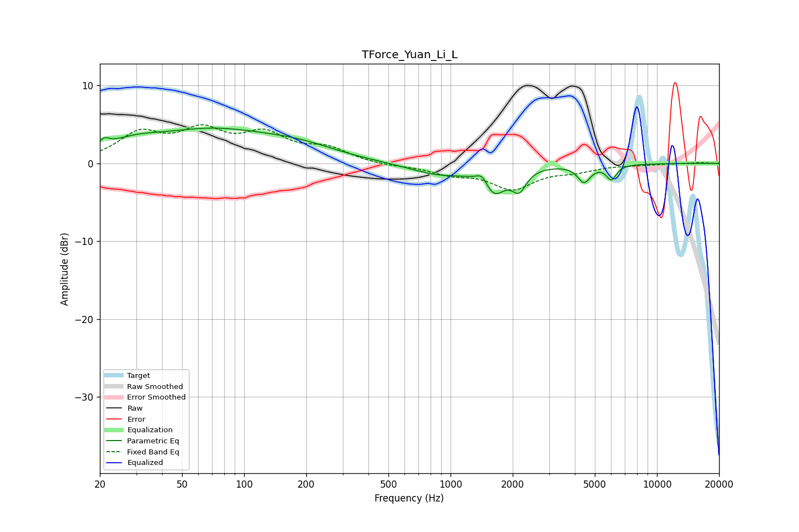

# TForce_Yuan_Li_L
See [usage instructions](https://github.com/jaakkopasanen/AutoEq#usage) for more options and info.

### Parametric EQs
Apply preamp of -4.6 dB when using parametric equalizer.

|   # | Type    |   Fc (Hz) |    Q |   Gain (dB) |
|-----|---------|-----------|------|-------------|
|   1 | Peaking |        21 | 5.98 |         0.9 |
|   2 | Peaking |        28 | 1.07 |         1.4 |
|   3 | Peaking |        70 | 0.47 |         4   |
|   4 | Peaking |       189 | 0.77 |         1.3 |
|   5 | Peaking |       879 | 0.97 |        -1.4 |
|   6 | Peaking |      1425 | 4.91 |         1.5 |
|   7 | Peaking |      1615 | 2.54 |        -3.5 |
|   8 | Peaking |      2150 | 4.21 |        -2.5 |
|   9 | Peaking |      4434 | 4.54 |        -2.2 |
|  10 | Peaking |      6016 | 5.65 |        -1.9 |

### Fixed Band EQs
When using fixed band (also called graphic) equalizer, apply preamp of **-5.1 dB** (if available) and set gains manually with these parameters.

|   # | Type    |   Fc (Hz) |    Q |   Gain (dB) |
|-----|---------|-----------|------|-------------|
|   1 | Peaking |        31 | 1.41 |         3.5 |
|   2 | Peaking |        62 | 1.41 |         3.7 |
|   3 | Peaking |       125 | 1.41 |         3.3 |
|   4 | Peaking |       250 | 1.41 |         1.7 |
|   5 | Peaking |       500 | 1.41 |        -0.3 |
|   6 | Peaking |      1000 | 1.41 |        -1.2 |
|   7 | Peaking |      2000 | 1.41 |        -3.1 |
|   8 | Peaking |      4000 | 1.41 |        -0.8 |
|   9 | Peaking |      8000 | 1.41 |        -0.1 |
|  10 | Peaking |     16000 | 1.41 |         0.1 |

### Graphs

