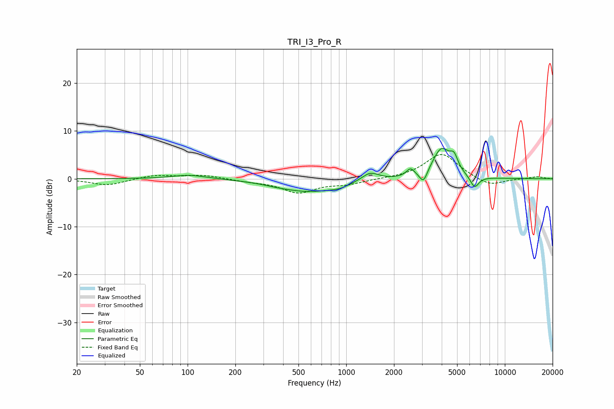

# TRI_I3_Pro_R
See [usage instructions](https://github.com/jaakkopasanen/AutoEq#usage) for more options and info.

### Parametric EQs
Apply preamp of -6.4 dB when using parametric equalizer.

|   # | Type    |   Fc (Hz) |    Q |   Gain (dB) |
|-----|---------|-----------|------|-------------|
|   1 | Peaking |       102 | 1.34 |         0.9 |
|   2 | Peaking |       368 | 1.59 |        -0.3 |
|   3 | Peaking |       598 | 0.75 |        -2.6 |
|   4 | Peaking |       907 | 2.69 |        -0.5 |
|   5 | Peaking |      1415 | 2.63 |         1.8 |
|   6 | Peaking |      2542 | 5.6  |         1.6 |
|   7 | Peaking |      3069 | 5.77 |        -2.6 |
|   8 | Peaking |      3981 | 2.46 |         6.2 |
|   9 | Peaking |      4783 | 5.59 |         2.7 |
|  10 | Peaking |      6442 | 5.02 |        -2.5 |

### Fixed Band EQs
When using fixed band (also called graphic) equalizer, apply preamp of **-5.2 dB** (if available) and set gains manually with these parameters.

|   # | Type    |   Fc (Hz) |    Q |   Gain (dB) |
|-----|---------|-----------|------|-------------|
|   1 | Peaking |        31 | 1.41 |        -1.4 |
|   2 | Peaking |        62 | 1.41 |         0.8 |
|   3 | Peaking |       125 | 1.41 |         0.8 |
|   4 | Peaking |       250 | 1.41 |        -0.5 |
|   5 | Peaking |       500 | 1.41 |        -2.8 |
|   6 | Peaking |      1000 | 1.41 |        -1   |
|   7 | Peaking |      2000 | 1.41 |         0   |
|   8 | Peaking |      4000 | 1.41 |         5.3 |
|   9 | Peaking |      8000 | 1.41 |        -1.7 |
|  10 | Peaking |     16000 | 1.41 |         0.4 |

### Graphs

