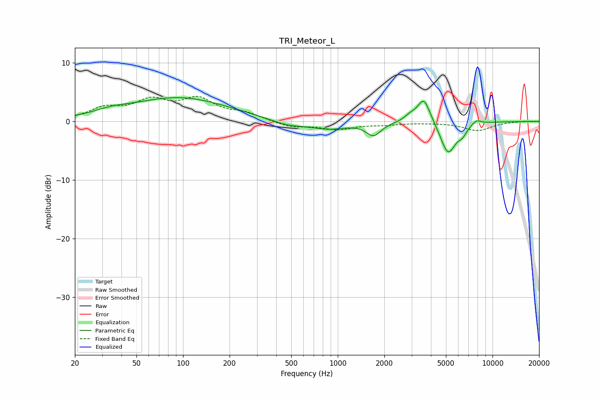

# TRI_Meteor_L
See [usage instructions](https://github.com/jaakkopasanen/AutoEq#usage) for more options and info.

### Parametric EQs
Apply preamp of -4.2 dB when using parametric equalizer.

|   # | Type    |   Fc (Hz) |    Q |   Gain (dB) |
|-----|---------|-----------|------|-------------|
|   1 | Peaking |        34 | 1.28 |         0.7 |
|   2 | Peaking |        94 | 0.45 |         4   |
|   3 | Peaking |       472 | 1.26 |        -0.9 |
|   4 | Peaking |       873 | 1.16 |        -1.2 |
|   5 | Peaking |      1703 | 2.98 |        -2.2 |
|   6 | Peaking |      2917 | 4.16 |         0.8 |
|   7 | Peaking |      3597 | 3.27 |         4.3 |
|   8 | Peaking |      5164 | 2.83 |        -5.6 |
|   9 | Peaking |      6390 | 4.77 |        -1.3 |
|  10 | Peaking |      7871 | 4.33 |         0.8 |

### Fixed Band EQs
When using fixed band (also called graphic) equalizer, apply preamp of **-4.4 dB** (if available) and set gains manually with these parameters.

|   # | Type    |   Fc (Hz) |    Q |   Gain (dB) |
|-----|---------|-----------|------|-------------|
|   1 | Peaking |        31 | 1.41 |         2   |
|   2 | Peaking |        62 | 1.41 |         3.1 |
|   3 | Peaking |       125 | 1.41 |         3.5 |
|   4 | Peaking |       250 | 1.41 |         1.2 |
|   5 | Peaking |       500 | 1.41 |        -1   |
|   6 | Peaking |      1000 | 1.41 |        -1.3 |
|   7 | Peaking |      2000 | 1.41 |        -0.4 |
|   8 | Peaking |      4000 | 1.41 |        -0.1 |
|   9 | Peaking |      8000 | 1.41 |        -1.5 |
|  10 | Peaking |     16000 | 1.41 |         0.1 |

### Graphs

