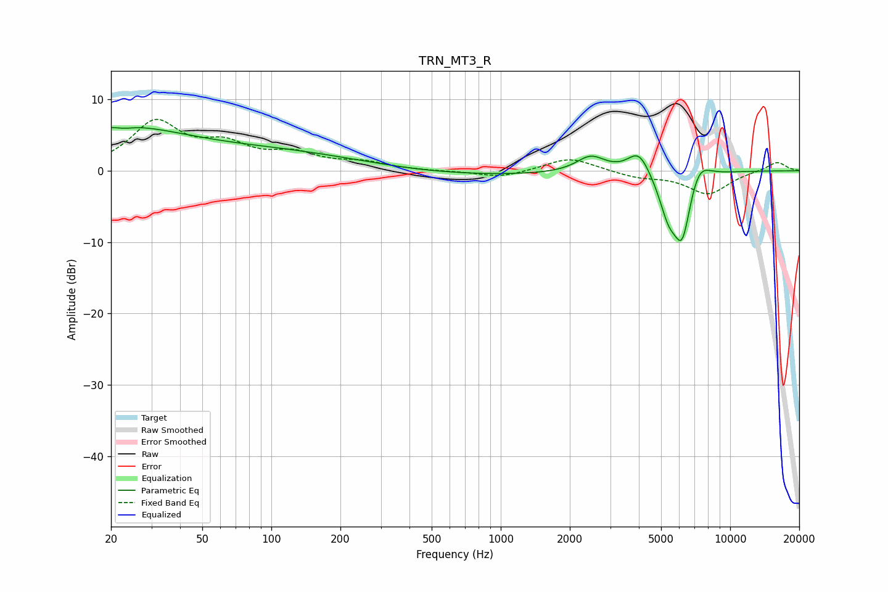

# TRN_MT3_R
See [usage instructions](https://github.com/jaakkopasanen/AutoEq#usage) for more options and info.

### Parametric EQs
Apply preamp of -6.1 dB when using parametric equalizer.

|   # | Type    |   Fc (Hz) |    Q |   Gain (dB) |
|-----|---------|-----------|------|-------------|
|   1 | Peaking |        21 | 0.45 |         5.8 |
|   2 | Peaking |        23 | 5.91 |         3.2 |
|   3 | Peaking |        23 | 5.67 |        -3.5 |
|   4 | Peaking |       120 | 0.38 |         2.4 |
|   5 | Peaking |       635 | 0.3  |        -0.8 |
|   6 | Peaking |      2467 | 2.26 |         2.3 |
|   7 | Peaking |      4004 | 2.86 |         3.3 |
|   8 | Peaking |      5385 | 3.25 |        -5   |
|   9 | Peaking |      6186 | 3.46 |        -8.8 |
|  10 | Peaking |      7284 | 2.84 |         3   |

### Fixed Band EQs
When using fixed band (also called graphic) equalizer, apply preamp of **-7.3 dB** (if available) and set gains manually with these parameters.

|   # | Type    |   Fc (Hz) |    Q |   Gain (dB) |
|-----|---------|-----------|------|-------------|
|   1 | Peaking |        31 | 1.41 |         6.6 |
|   2 | Peaking |        62 | 1.41 |         3   |
|   3 | Peaking |       125 | 1.41 |         2   |
|   4 | Peaking |       250 | 1.41 |         1   |
|   5 | Peaking |       500 | 1.41 |        -0.1 |
|   6 | Peaking |      1000 | 1.41 |        -1   |
|   7 | Peaking |      2000 | 1.41 |         1.9 |
|   8 | Peaking |      4000 | 1.41 |        -0.8 |
|   9 | Peaking |      8000 | 1.41 |        -3.2 |
|  10 | Peaking |     16000 | 1.41 |         1.3 |

### Graphs

