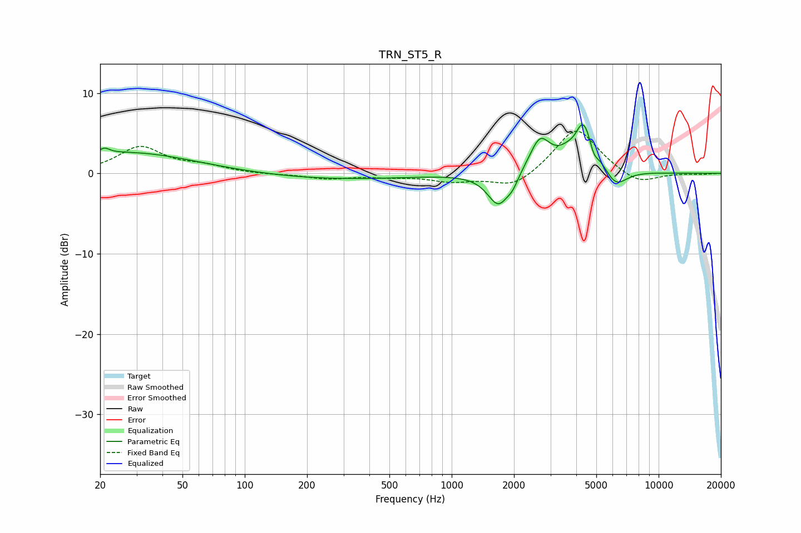

# TRN_ST5_R
See [usage instructions](https://github.com/jaakkopasanen/AutoEq#usage) for more options and info.

### Parametric EQs
Apply preamp of -6.2 dB when using parametric equalizer.

|   # | Type    |   Fc (Hz) |    Q |   Gain (dB) |
|-----|---------|-----------|------|-------------|
|   1 | Peaking |        21 | 5.86 |         0.7 |
|   2 | Peaking |        27 | 0.44 |         2.6 |
|   3 | Peaking |       276 | 0.4  |        -0.7 |
|   4 | Peaking |      1685 | 2.65 |        -4.2 |
|   5 | Peaking |      1973 | 5.59 |        -0.9 |
|   6 | Peaking |      2667 | 2.88 |         4   |
|   7 | Peaking |      3969 | 4.63 |        -1.3 |
|   8 | Peaking |      4300 | 2.35 |         7.7 |
|   9 | Peaking |      4844 | 5.94 |        -1.9 |
|  10 | Peaking |      6163 | 2.45 |        -2.6 |

### Fixed Band EQs
When using fixed band (also called graphic) equalizer, apply preamp of **-5.3 dB** (if available) and set gains manually with these parameters.

|   # | Type    |   Fc (Hz) |    Q |   Gain (dB) |
|-----|---------|-----------|------|-------------|
|   1 | Peaking |        31 | 1.41 |         3.2 |
|   2 | Peaking |        62 | 1.41 |         0.8 |
|   3 | Peaking |       125 | 1.41 |        -0.1 |
|   4 | Peaking |       250 | 1.41 |        -0.6 |
|   5 | Peaking |       500 | 1.41 |        -0.3 |
|   6 | Peaking |      1000 | 1.41 |        -0.9 |
|   7 | Peaking |      2000 | 1.41 |        -1.9 |
|   8 | Peaking |      4000 | 1.41 |         5.8 |
|   9 | Peaking |      8000 | 1.41 |        -1.5 |
|  10 | Peaking |     16000 | 1.41 |        -0.1 |

### Graphs

