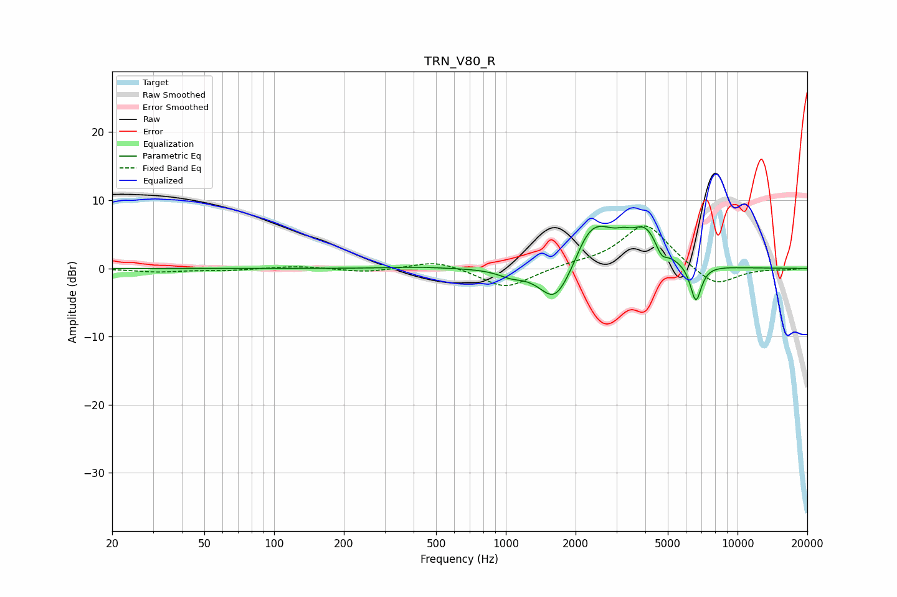

# TRN_V80_R
See [usage instructions](https://github.com/jaakkopasanen/AutoEq#usage) for more options and info.

### Parametric EQs
Apply preamp of -6.3 dB when using parametric equalizer.

|   # | Type    |   Fc (Hz) |    Q |   Gain (dB) |
|-----|---------|-----------|------|-------------|
|   1 | Peaking |       409 | 1.31 |         0.2 |
|   2 | Peaking |      1053 | 2.45 |        -1   |
|   3 | Peaking |      1636 | 1.97 |        -6.8 |
|   4 | Peaking |      1942 | 3.26 |        -1   |
|   5 | Peaking |      2264 | 2.02 |         1.5 |
|   6 | Peaking |      2393 | 1.33 |         6.2 |
|   7 | Peaking |      3228 | 4.27 |         0.8 |
|   8 | Peaking |      4014 | 2.33 |         4.4 |
|   9 | Peaking |      4693 | 5.91 |        -1.6 |
|  10 | Peaking |      6609 | 5.68 |        -5.5 |

### Fixed Band EQs
When using fixed band (also called graphic) equalizer, apply preamp of **-6.3 dB** (if available) and set gains manually with these parameters.

|   # | Type    |   Fc (Hz) |    Q |   Gain (dB) |
|-----|---------|-----------|------|-------------|
|   1 | Peaking |        31 | 1.41 |        -0.5 |
|   2 | Peaking |        62 | 1.41 |        -0.3 |
|   3 | Peaking |       125 | 1.41 |         0.4 |
|   4 | Peaking |       250 | 1.41 |        -0.6 |
|   5 | Peaking |       500 | 1.41 |         1.2 |
|   6 | Peaking |      1000 | 1.41 |        -3   |
|   7 | Peaking |      2000 | 1.41 |         0.5 |
|   8 | Peaking |      4000 | 1.41 |         6.6 |
|   9 | Peaking |      8000 | 1.41 |        -2.9 |
|  10 | Peaking |     16000 | 1.41 |        -0.1 |

### Graphs

