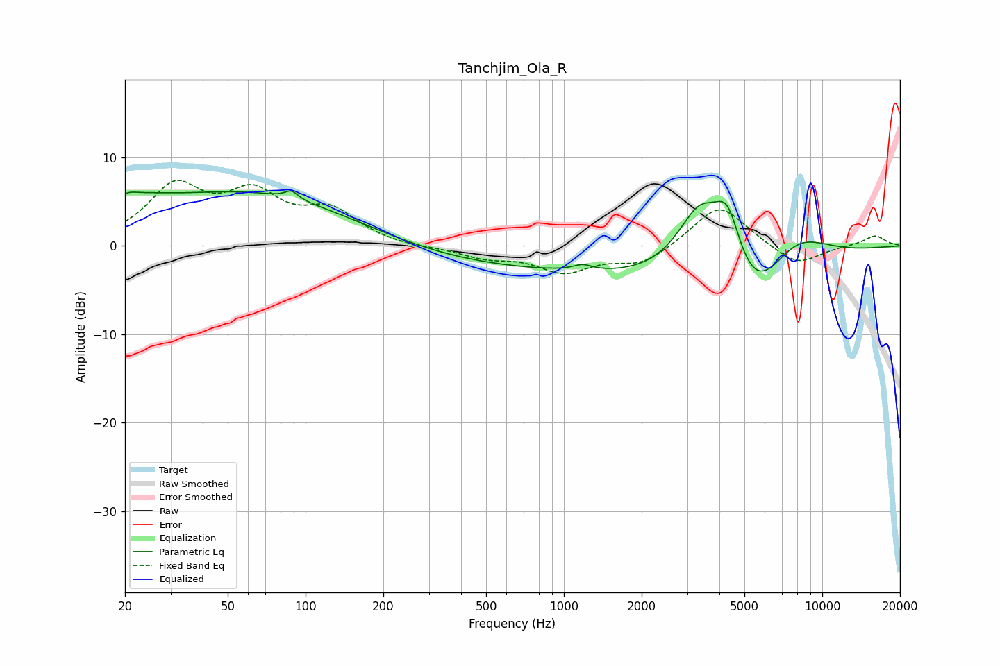

# Tanchjim_Ola_R
See [usage instructions](https://github.com/jaakkopasanen/AutoEq#usage) for more options and info.

### Parametric EQs
Apply preamp of -6.3 dB when using parametric equalizer.

|   # | Type    |   Fc (Hz) |    Q |   Gain (dB) |
|-----|---------|-----------|------|-------------|
|   1 | Peaking |        20 | 3.58 |         0.9 |
|   2 | Peaking |        22 | 1.07 |         1.9 |
|   3 | Peaking |        63 | 0.34 |         6   |
|   4 | Peaking |        88 | 5.79 |         0.9 |
|   5 | Peaking |       961 | 0.18 |        -2.7 |
|   6 | Peaking |      1184 | 3.78 |         0.7 |
|   7 | Peaking |      3352 | 1.38 |         9.8 |
|   8 | Peaking |      4309 | 2.38 |         8   |
|   9 | Peaking |      5241 | 0.69 |       -12.3 |
|  10 | Peaking |      7690 | 0.88 |         7   |

### Fixed Band EQs
When using fixed band (also called graphic) equalizer, apply preamp of **-7.5 dB** (if available) and set gains manually with these parameters.

|   # | Type    |   Fc (Hz) |    Q |   Gain (dB) |
|-----|---------|-----------|------|-------------|
|   1 | Peaking |        31 | 1.41 |         6.3 |
|   2 | Peaking |        62 | 1.41 |         5.1 |
|   3 | Peaking |       125 | 1.41 |         3.5 |
|   4 | Peaking |       250 | 1.41 |        -0.2 |
|   5 | Peaking |       500 | 1.41 |        -1.2 |
|   6 | Peaking |      1000 | 1.41 |        -2.8 |
|   7 | Peaking |      2000 | 1.41 |        -2.1 |
|   8 | Peaking |      4000 | 1.41 |         4.8 |
|   9 | Peaking |      8000 | 1.41 |        -2.3 |
|  10 | Peaking |     16000 | 1.41 |         1.2 |

### Graphs

