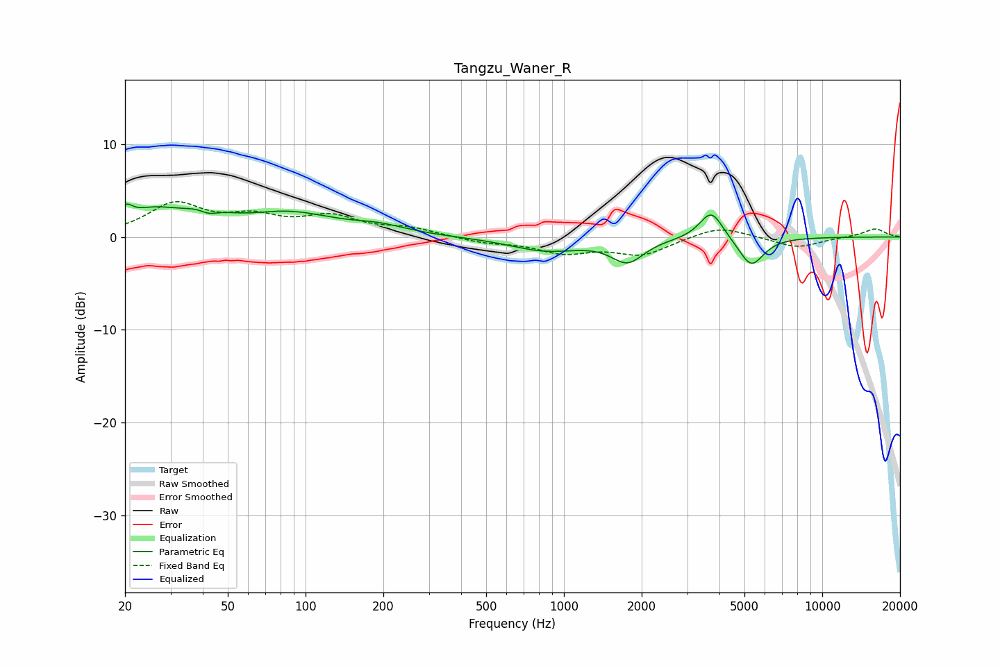

# Tangzu_Waner_R
See [usage instructions](https://github.com/jaakkopasanen/AutoEq#usage) for more options and info.

### Parametric EQs
Apply preamp of -3.6 dB when using parametric equalizer.

|   # | Type    |   Fc (Hz) |    Q |   Gain (dB) |
|-----|---------|-----------|------|-------------|
|   1 | Peaking |        20 | 5.73 |         1.4 |
|   2 | Peaking |        26 | 1.28 |         2.4 |
|   3 | Peaking |        41 | 2.03 |         2.2 |
|   4 | Peaking |        42 | 3.32 |        -1.5 |
|   5 | Peaking |        86 | 0.8  |         2.4 |
|   6 | Peaking |       192 | 1.3  |         0.8 |
|   7 | Peaking |       848 | 1.03 |        -1.4 |
|   8 | Peaking |      1763 | 2.26 |        -2.5 |
|   9 | Peaking |      3722 | 3.11 |         3.1 |
|  10 | Peaking |      5308 | 2.88 |        -3.2 |

### Fixed Band EQs
When using fixed band (also called graphic) equalizer, apply preamp of **-3.9 dB** (if available) and set gains manually with these parameters.

|   # | Type    |   Fc (Hz) |    Q |   Gain (dB) |
|-----|---------|-----------|------|-------------|
|   1 | Peaking |        31 | 1.41 |         3.4 |
|   2 | Peaking |        62 | 1.41 |         1.8 |
|   3 | Peaking |       125 | 1.41 |         2   |
|   4 | Peaking |       250 | 1.41 |         0.8 |
|   5 | Peaking |       500 | 1.41 |        -0.6 |
|   6 | Peaking |      1000 | 1.41 |        -1.6 |
|   7 | Peaking |      2000 | 1.41 |        -1.8 |
|   8 | Peaking |      4000 | 1.41 |         1.3 |
|   9 | Peaking |      8000 | 1.41 |        -1.2 |
|  10 | Peaking |     16000 | 1.41 |         0.9 |

### Graphs

