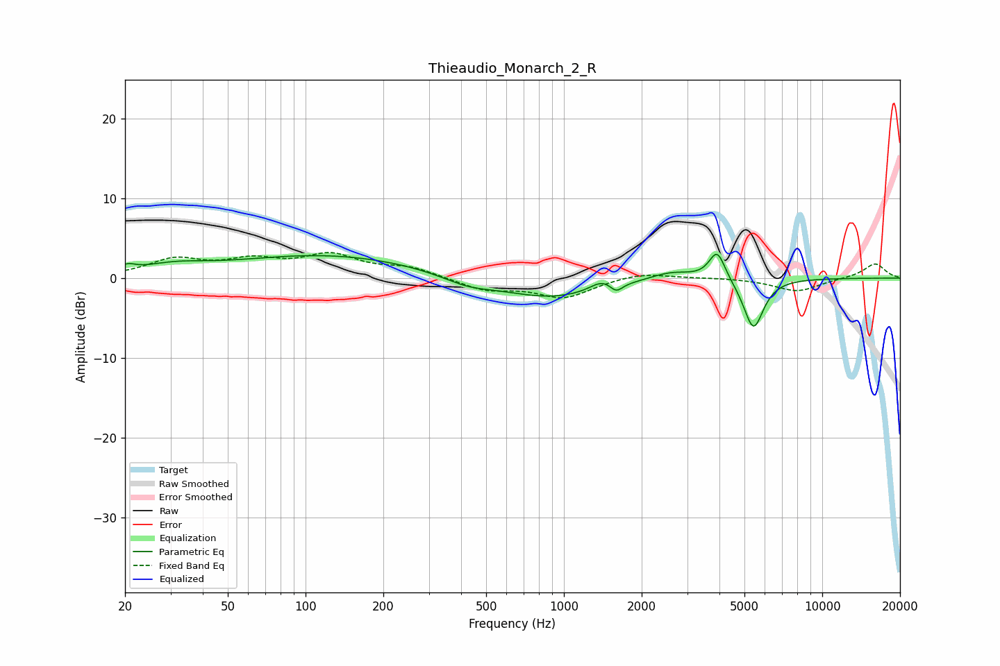

# Thieaudio_Monarch_2_R
See [usage instructions](https://github.com/jaakkopasanen/AutoEq#usage) for more options and info.

### Parametric EQs
Apply preamp of -3.1 dB when using parametric equalizer.

|   # | Type    |   Fc (Hz) |    Q |   Gain (dB) |
|-----|---------|-----------|------|-------------|
|   1 | Peaking |        20 | 4.68 |         0.7 |
|   2 | Peaking |        31 | 1.12 |         1.1 |
|   3 | Peaking |       121 | 0.38 |         2.9 |
|   4 | Peaking |       423 | 1.45 |        -1   |
|   5 | Peaking |       891 | 0.69 |        -2.6 |
|   6 | Peaking |      1400 | 3.15 |         1.1 |
|   7 | Peaking |      1596 | 6    |        -1.1 |
|   8 | Peaking |      2602 | 1.58 |         1.2 |
|   9 | Peaking |      3922 | 4.49 |         3.7 |
|  10 | Peaking |      5420 | 3.59 |        -6.4 |

### Fixed Band EQs
When using fixed band (also called graphic) equalizer, apply preamp of **-3.3 dB** (if available) and set gains manually with these parameters.

|   # | Type    |   Fc (Hz) |    Q |   Gain (dB) |
|-----|---------|-----------|------|-------------|
|   1 | Peaking |        31 | 1.41 |         2.2 |
|   2 | Peaking |        62 | 1.41 |         1.9 |
|   3 | Peaking |       125 | 1.41 |         2.6 |
|   4 | Peaking |       250 | 1.41 |         1.2 |
|   5 | Peaking |       500 | 1.41 |        -1.5 |
|   6 | Peaking |      1000 | 1.41 |        -2.4 |
|   7 | Peaking |      2000 | 1.41 |         0.8 |
|   8 | Peaking |      4000 | 1.41 |         0.1 |
|   9 | Peaking |      8000 | 1.41 |        -1.7 |
|  10 | Peaking |     16000 | 1.41 |         1.8 |

### Graphs

