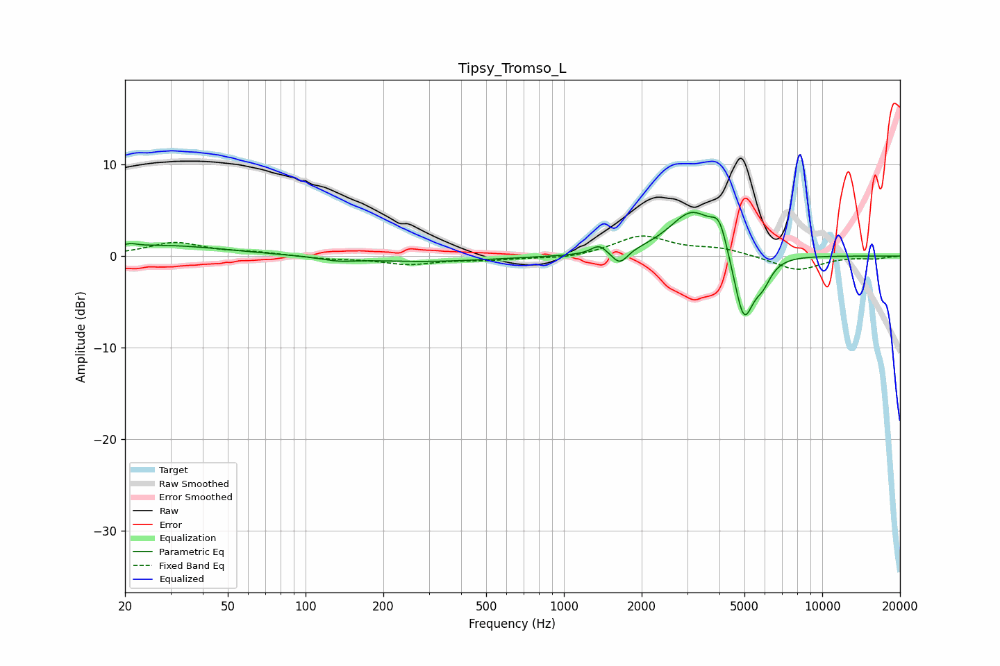

# Tipsy_Tromso_L
See [usage instructions](https://github.com/jaakkopasanen/AutoEq#usage) for more options and info.

### Parametric EQs
Apply preamp of -4.9 dB when using parametric equalizer.

|   # | Type    |   Fc (Hz) |    Q |   Gain (dB) |
|-----|---------|-----------|------|-------------|
|   1 | Peaking |        21 | 5.98 |         0.3 |
|   2 | Peaking |        27 | 0.56 |         1.2 |
|   3 | Peaking |       134 | 2.13 |        -0.4 |
|   4 | Peaking |       289 | 0.56 |        -0.6 |
|   5 | Peaking |      1369 | 4.74 |         1   |
|   6 | Peaking |      1645 | 4.67 |        -1.5 |
|   7 | Peaking |      3146 | 1.57 |         5   |
|   8 | Peaking |      4002 | 4.43 |         3   |
|   9 | Peaking |      4969 | 3.47 |        -7.8 |
|  10 | Peaking |      5892 | 4.18 |        -1.9 |

### Fixed Band EQs
When using fixed band (also called graphic) equalizer, apply preamp of **-2.3 dB** (if available) and set gains manually with these parameters.

|   # | Type    |   Fc (Hz) |    Q |   Gain (dB) |
|-----|---------|-----------|------|-------------|
|   1 | Peaking |        31 | 1.41 |         1.4 |
|   2 | Peaking |        62 | 1.41 |         0.3 |
|   3 | Peaking |       125 | 1.41 |        -0.3 |
|   4 | Peaking |       250 | 1.41 |        -0.8 |
|   5 | Peaking |       500 | 1.41 |        -0.4 |
|   6 | Peaking |      1000 | 1.41 |        -0.3 |
|   7 | Peaking |      2000 | 1.41 |         2.2 |
|   8 | Peaking |      4000 | 1.41 |         0.8 |
|   9 | Peaking |      8000 | 1.41 |        -1.6 |
|  10 | Peaking |     16000 | 1.41 |        -0.3 |

### Graphs

