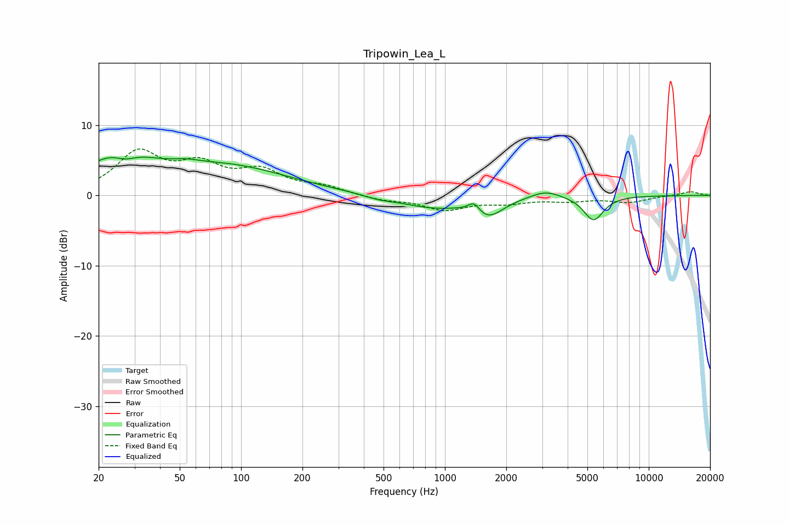

# Tripowin_Lea_L
See [usage instructions](https://github.com/jaakkopasanen/AutoEq#usage) for more options and info.

### Parametric EQs
Apply preamp of -5.5 dB when using parametric equalizer.

|   # | Type    |   Fc (Hz) |    Q |   Gain (dB) |
|-----|---------|-----------|------|-------------|
|   1 | Peaking |        25 | 0.88 |         5.1 |
|   2 | Peaking |        27 | 2.51 |        -1.4 |
|   3 | Peaking |        54 | 2.55 |         0.4 |
|   4 | Peaking |        85 | 0.46 |         3.9 |
|   5 | Peaking |       475 | 1.93 |        -0.4 |
|   6 | Peaking |       866 | 0.89 |        -1.7 |
|   7 | Peaking |      1388 | 5.07 |         1.4 |
|   8 | Peaking |      1632 | 1.96 |        -2.6 |
|   9 | Peaking |      3115 | 1.98 |         1   |
|  10 | Peaking |      5362 | 2.87 |        -3.5 |

### Fixed Band EQs
When using fixed band (also called graphic) equalizer, apply preamp of **-6.7 dB** (if available) and set gains manually with these parameters.

|   # | Type    |   Fc (Hz) |    Q |   Gain (dB) |
|-----|---------|-----------|------|-------------|
|   1 | Peaking |        31 | 1.41 |         5.8 |
|   2 | Peaking |        62 | 1.41 |         3.7 |
|   3 | Peaking |       125 | 1.41 |         3.1 |
|   4 | Peaking |       250 | 1.41 |         1.1 |
|   5 | Peaking |       500 | 1.41 |        -0.6 |
|   6 | Peaking |      1000 | 1.41 |        -1.9 |
|   7 | Peaking |      2000 | 1.41 |        -0.9 |
|   8 | Peaking |      4000 | 1.41 |        -0.7 |
|   9 | Peaking |      8000 | 1.41 |        -0.9 |
|  10 | Peaking |     16000 | 1.41 |         0.6 |

### Graphs

