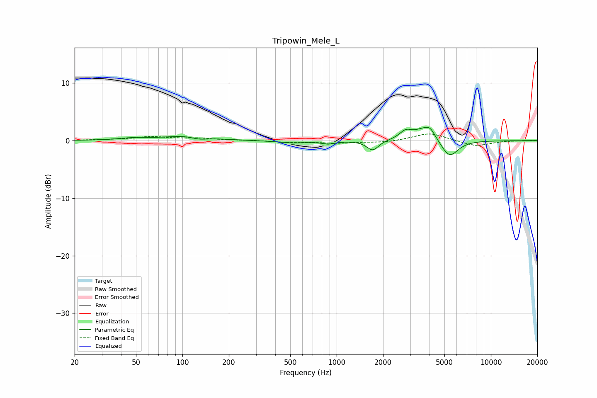

# Tripowin_Mele_L
See [usage instructions](https://github.com/jaakkopasanen/AutoEq#usage) for more options and info.

### Parametric EQs
Apply preamp of -2.4 dB when using parametric equalizer.

|   # | Type    |   Fc (Hz) |    Q |   Gain (dB) |
|-----|---------|-----------|------|-------------|
|   1 | Peaking |        49 | 1.49 |         0.4 |
|   2 | Peaking |       109 | 1.05 |         0.9 |
|   3 | Peaking |       127 | 2.5  |        -0.6 |
|   4 | Peaking |       518 | 1.42 |        -0.4 |
|   5 | Peaking |       885 | 3.36 |        -0.5 |
|   6 | Peaking |      1712 | 3.73 |        -1.8 |
|   7 | Peaking |      2796 | 3.66 |         1.3 |
|   8 | Peaking |      3761 | 1.95 |         2.3 |
|   9 | Peaking |      4039 | 5.3  |         0.8 |
|  10 | Peaking |      5381 | 2.46 |        -3.2 |

### Fixed Band EQs
When using fixed band (also called graphic) equalizer, apply preamp of **-1.2 dB** (if available) and set gains manually with these parameters.

|   # | Type    |   Fc (Hz) |    Q |   Gain (dB) |
|-----|---------|-----------|------|-------------|
|   1 | Peaking |        31 | 1.41 |         0.1 |
|   2 | Peaking |        62 | 1.41 |         0.6 |
|   3 | Peaking |       125 | 1.41 |         0.4 |
|   4 | Peaking |       250 | 1.41 |         0.1 |
|   5 | Peaking |       500 | 1.41 |        -0.3 |
|   6 | Peaking |      1000 | 1.41 |        -0.4 |
|   7 | Peaking |      2000 | 1.41 |        -0.3 |
|   8 | Peaking |      4000 | 1.41 |         1.4 |
|   9 | Peaking |      8000 | 1.41 |        -1   |
|  10 | Peaking |     16000 | 1.41 |         0   |

### Graphs

