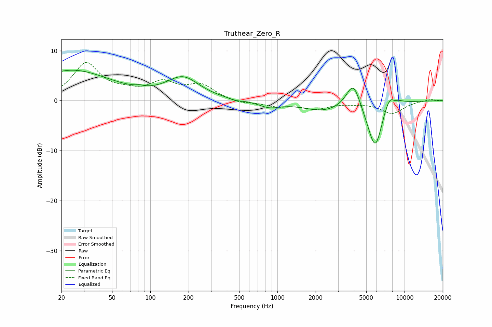

# Truthear_Zero_R
See [usage instructions](https://github.com/jaakkopasanen/AutoEq#usage) for more options and info.

### Parametric EQs
Apply preamp of -6.2 dB when using parametric equalizer.

|   # | Type    |   Fc (Hz) |    Q |   Gain (dB) |
|-----|---------|-----------|------|-------------|
|   1 | Peaking |        24 | 0.46 |         6   |
|   2 | Peaking |        82 | 5.05 |         0.3 |
|   3 | Peaking |       181 | 1.1  |         4.3 |
|   4 | Peaking |       471 | 2.83 |        -0.3 |
|   5 | Peaking |       862 | 1.68 |        -1.2 |
|   6 | Peaking |      2304 | 0.86 |        -1.9 |
|   7 | Peaking |      3959 | 2.47 |         5.7 |
|   8 | Peaking |      5888 | 2.1  |       -10.5 |
|   9 | Peaking |      7638 | 2.16 |         4   |
|  10 | Peaking |      8329 | 6    |        -0.6 |

### Fixed Band EQs
When using fixed band (also called graphic) equalizer, apply preamp of **-7.7 dB** (if available) and set gains manually with these parameters.

|   # | Type    |   Fc (Hz) |    Q |   Gain (dB) |
|-----|---------|-----------|------|-------------|
|   1 | Peaking |        31 | 1.41 |         7.3 |
|   2 | Peaking |        62 | 1.41 |         1.1 |
|   3 | Peaking |       125 | 1.41 |         3.2 |
|   4 | Peaking |       250 | 1.41 |         2.9 |
|   5 | Peaking |       500 | 1.41 |        -0.6 |
|   6 | Peaking |      1000 | 1.41 |        -1   |
|   7 | Peaking |      2000 | 1.41 |        -1.5 |
|   8 | Peaking |      4000 | 1.41 |        -0.3 |
|   9 | Peaking |      8000 | 1.41 |        -2.5 |
|  10 | Peaking |     16000 | 1.41 |         0.3 |

### Graphs

