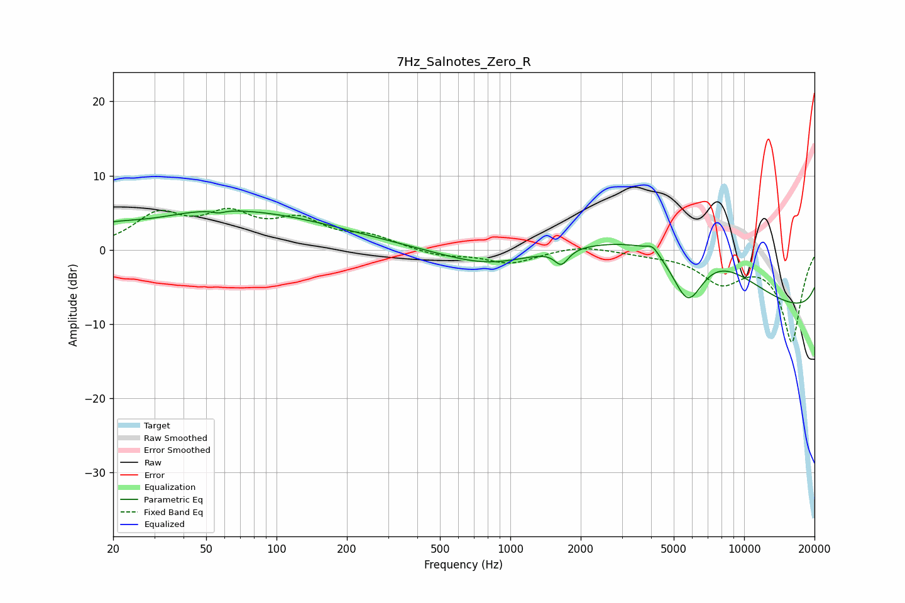

# 7Hz_Salnotes_Zero_R
See [usage instructions](https://github.com/jaakkopasanen/AutoEq#usage) for more options and info.

### Parametric EQs
Apply preamp of -5.3 dB when using parametric equalizer.

|   # | Type    |   Fc (Hz) |    Q |   Gain (dB) |
|-----|---------|-----------|------|-------------|
|   1 | Peaking |        29 | 1.04 |        -1   |
|   2 | Peaking |        51 | 0.26 |         5.8 |
|   3 | Peaking |        57 | 5.99 |        -0.3 |
|   4 | Peaking |        67 | 0.52 |        -0.2 |
|   5 | Peaking |       818 | 0.7  |        -2.7 |
|   6 | Peaking |      1654 | 4.86 |        -2   |
|   7 | Peaking |      4061 | 5.26 |         1   |
|   8 | Peaking |      5744 | 1.69 |        -9.9 |
|   9 | Peaking |      6177 | 0.31 |        19.5 |
|  10 | Peaking |     10000 | 0.18 |       -17.8 |

### Fixed Band EQs
When using fixed band (also called graphic) equalizer, apply preamp of **-5.7 dB** (if available) and set gains manually with these parameters.

|   # | Type    |   Fc (Hz) |    Q |   Gain (dB) |
|-----|---------|-----------|------|-------------|
|   1 | Peaking |        31 | 1.41 |         4.4 |
|   2 | Peaking |        62 | 1.41 |         4.1 |
|   3 | Peaking |       125 | 1.41 |         3.5 |
|   4 | Peaking |       250 | 1.41 |         1.6 |
|   5 | Peaking |       500 | 1.41 |        -0.8 |
|   6 | Peaking |      1000 | 1.41 |        -1.8 |
|   7 | Peaking |      2000 | 1.41 |         0.7 |
|   8 | Peaking |      4000 | 1.41 |        -0.4 |
|   9 | Peaking |      8000 | 1.41 |        -4   |
|  10 | Peaking |     16000 | 1.41 |       -12.3 |

### Graphs

