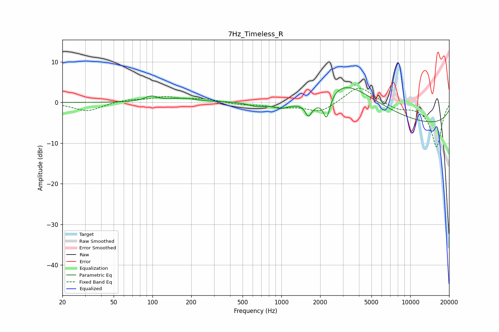

# 7Hz_Timeless_R
See [usage instructions](https://github.com/jaakkopasanen/AutoEq#usage) for more options and info.

### Parametric EQs
Apply preamp of -3.7 dB when using parametric equalizer.

|   # | Type    |   Fc (Hz) |    Q |   Gain (dB) |
|-----|---------|-----------|------|-------------|
|   1 | Peaking |        98 | 2.81 |         1.3 |
|   2 | Peaking |       172 | 1.41 |         0.9 |
|   3 | Peaking |       649 | 1.81 |        -1.3 |
|   4 | Peaking |       997 | 2.16 |        -1.7 |
|   5 | Peaking |      1564 | 4.85 |         1.6 |
|   6 | Peaking |      1607 | 5.17 |        -4.3 |
|   7 | Peaking |      1829 | 0.92 |        -5.6 |
|   8 | Peaking |      2246 | 5.47 |        -5.6 |
|   9 | Peaking |      2809 | 0.53 |        11   |
|  10 | Peaking |     10000 | 0.18 |        -5.8 |

### Fixed Band EQs
When using fixed band (also called graphic) equalizer, apply preamp of **-3.6 dB** (if available) and set gains manually with these parameters.

|   # | Type    |   Fc (Hz) |    Q |   Gain (dB) |
|-----|---------|-----------|------|-------------|
|   1 | Peaking |        31 | 1.41 |        -2.2 |
|   2 | Peaking |        62 | 1.41 |         0.7 |
|   3 | Peaking |       125 | 1.41 |         1.2 |
|   4 | Peaking |       250 | 1.41 |         0.8 |
|   5 | Peaking |       500 | 1.41 |        -0.5 |
|   6 | Peaking |      1000 | 1.41 |        -1   |
|   7 | Peaking |      2000 | 1.41 |        -2.5 |
|   8 | Peaking |      4000 | 1.41 |         4.3 |
|   9 | Peaking |      8000 | 1.41 |        -1.5 |
|  10 | Peaking |     16000 | 1.41 |       -11   |

### Graphs

