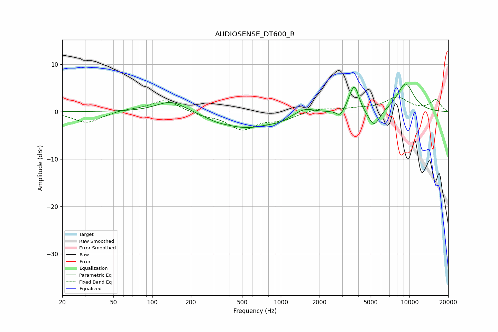

# AUDIOSENSE_DT600_R
See [usage instructions](https://github.com/jaakkopasanen/AutoEq#usage) for more options and info.

### Parametric EQs
Apply preamp of -5.9 dB when using parametric equalizer.

|   # | Type    |   Fc (Hz) |    Q |   Gain (dB) |
|-----|---------|-----------|------|-------------|
|   1 | Peaking |       140 | 1.27 |         2.4 |
|   2 | Peaking |       318 | 1.55 |        -0.7 |
|   3 | Peaking |       551 | 0.74 |        -3.2 |
|   4 | Peaking |       972 | 2    |        -0.7 |
|   5 | Peaking |      1534 | 1.94 |         1.3 |
|   6 | Peaking |      2882 | 5.13 |        -1.4 |
|   7 | Peaking |      3530 | 4.37 |         1.6 |
|   8 | Peaking |      3775 | 4.24 |         4.5 |
|   9 | Peaking |      5311 | 2.97 |        -3.7 |
|  10 | Peaking |      9306 | 1.88 |         6   |

### Fixed Band EQs
When using fixed band (also called graphic) equalizer, apply preamp of **-3.2 dB** (if available) and set gains manually with these parameters.

|   # | Type    |   Fc (Hz) |    Q |   Gain (dB) |
|-----|---------|-----------|------|-------------|
|   1 | Peaking |        31 | 1.41 |        -2.4 |
|   2 | Peaking |        62 | 1.41 |         0.4 |
|   3 | Peaking |       125 | 1.41 |         2.6 |
|   4 | Peaking |       250 | 1.41 |        -0.7 |
|   5 | Peaking |       500 | 1.41 |        -3.6 |
|   6 | Peaking |      1000 | 1.41 |        -1.5 |
|   7 | Peaking |      2000 | 1.41 |         0.7 |
|   8 | Peaking |      4000 | 1.41 |         0.5 |
|   9 | Peaking |      8000 | 1.41 |         2.9 |
|  10 | Peaking |     16000 | 1.41 |         2.4 |

### Graphs

