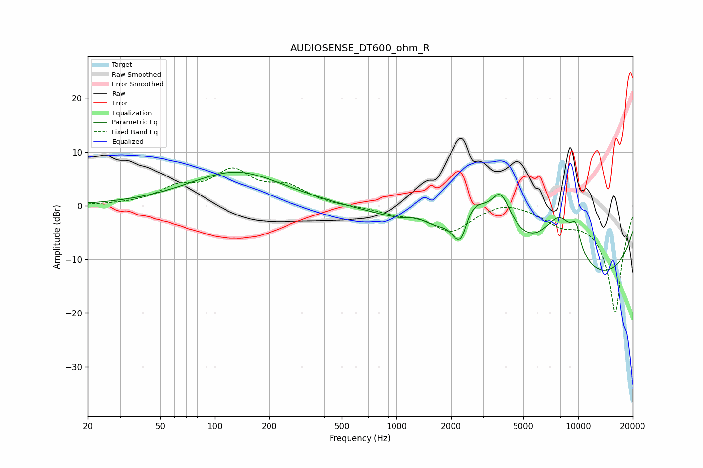

# AUDIOSENSE_DT600_ohm_R
See [usage instructions](https://github.com/jaakkopasanen/AutoEq#usage) for more options and info.

### Parametric EQs
Apply preamp of -6.3 dB when using parametric equalizer.

|   # | Type    |   Fc (Hz) |    Q |   Gain (dB) |
|-----|---------|-----------|------|-------------|
|   1 | Peaking |       131 | 0.55 |         6.3 |
|   2 | Peaking |      1299 | 2.57 |         1.1 |
|   3 | Peaking |      2087 | 5.84 |        -0.9 |
|   4 | Peaking |      2210 | 4.49 |        -1.9 |
|   5 | Peaking |      2303 | 5.48 |        -2.5 |
|   6 | Peaking |      2688 | 1.74 |         6.2 |
|   7 | Peaking |      3766 | 2.22 |         8.8 |
|   8 | Peaking |      7932 | 1    |        14.5 |
|   9 | Peaking |      9315 | 0.23 |       -18.5 |
|  10 | Peaking |      9709 | 4.63 |         4.1 |

### Fixed Band EQs
When using fixed band (also called graphic) equalizer, apply preamp of **-7.1 dB** (if available) and set gains manually with these parameters.

|   # | Type    |   Fc (Hz) |    Q |   Gain (dB) |
|-----|---------|-----------|------|-------------|
|   1 | Peaking |        31 | 1.41 |         0.1 |
|   2 | Peaking |        62 | 1.41 |         2.9 |
|   3 | Peaking |       125 | 1.41 |         5.9 |
|   4 | Peaking |       250 | 1.41 |         3.1 |
|   5 | Peaking |       500 | 1.41 |        -0.2 |
|   6 | Peaking |      1000 | 1.41 |        -1.2 |
|   7 | Peaking |      2000 | 1.41 |        -4.6 |
|   8 | Peaking |      4000 | 1.41 |         1.3 |
|   9 | Peaking |      8000 | 1.41 |        -2.5 |
|  10 | Peaking |     16000 | 1.41 |       -20   |

### Graphs

