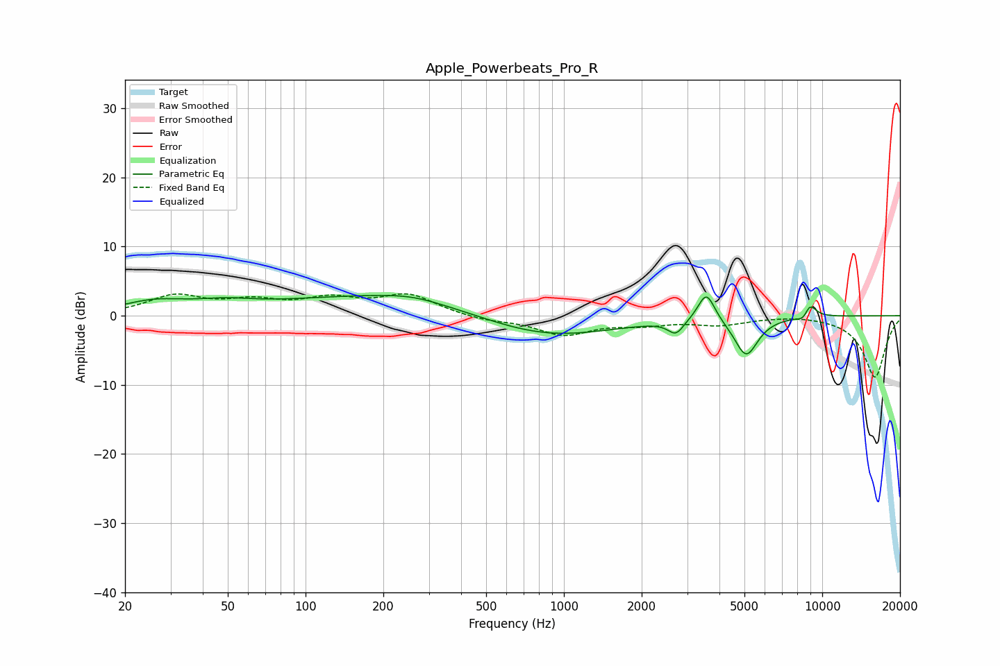

# Apple_Powerbeats_Pro_R
See [usage instructions](https://github.com/jaakkopasanen/AutoEq#usage) for more options and info.

### Parametric EQs
Apply preamp of -3.0 dB when using parametric equalizer.

|   # | Type    |   Fc (Hz) |    Q |   Gain (dB) |
|-----|---------|-----------|------|-------------|
|   1 | Peaking |        26 | 1.13 |         1.7 |
|   2 | Peaking |        49 | 1.18 |         1.1 |
|   3 | Peaking |       212 | 0.34 |         3   |
|   4 | Peaking |       257 | 1.22 |         0.7 |
|   5 | Peaking |       824 | 0.53 |        -3.6 |
|   6 | Peaking |      2714 | 4.7  |        -2   |
|   7 | Peaking |      3561 | 4.24 |         4.4 |
|   8 | Peaking |      5078 | 3.06 |        -5.6 |
|   9 | Peaking |      8561 | 5.07 |        -1.9 |
|  10 | Peaking |      8872 | 4.84 |         3   |

### Fixed Band EQs
When using fixed band (also called graphic) equalizer, apply preamp of **-3.3 dB** (if available) and set gains manually with these parameters.

|   # | Type    |   Fc (Hz) |    Q |   Gain (dB) |
|-----|---------|-----------|------|-------------|
|   1 | Peaking |        31 | 1.41 |         2.7 |
|   2 | Peaking |        62 | 1.41 |         1.8 |
|   3 | Peaking |       125 | 1.41 |         2.1 |
|   4 | Peaking |       250 | 1.41 |         2.9 |
|   5 | Peaking |       500 | 1.41 |        -0.7 |
|   6 | Peaking |      1000 | 1.41 |        -2.6 |
|   7 | Peaking |      2000 | 1.41 |        -1   |
|   8 | Peaking |      4000 | 1.41 |        -1.2 |
|   9 | Peaking |      8000 | 1.41 |         0.2 |
|  10 | Peaking |     16000 | 1.41 |        -8.9 |

### Graphs

