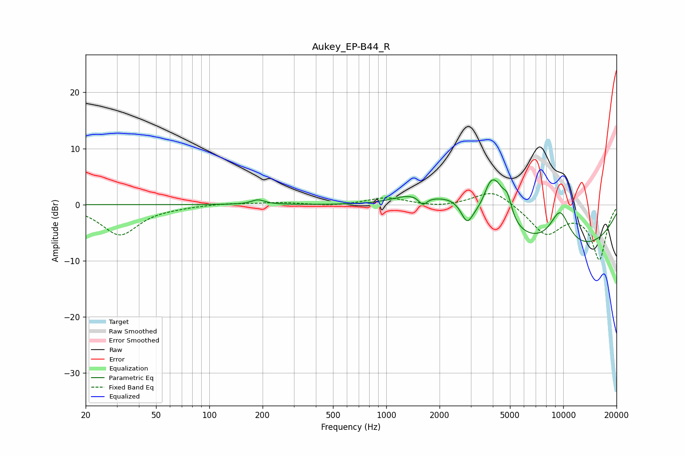

# Aukey_EP-B44_R
See [usage instructions](https://github.com/jaakkopasanen/AutoEq#usage) for more options and info.

### Parametric EQs
Apply preamp of -4.5 dB when using parametric equalizer.

|   # | Type    |   Fc (Hz) |    Q |   Gain (dB) |
|-----|---------|-----------|------|-------------|
|   1 | Peaking |       189 | 3.76 |         0.8 |
|   2 | Peaking |      1416 | 1.22 |         2.2 |
|   3 | Peaking |      1609 | 5.98 |        -1.6 |
|   4 | Peaking |      2406 | 1.32 |         2.9 |
|   5 | Peaking |      2860 | 4.38 |        -3.3 |
|   6 | Peaking |      3828 | 4.09 |         3.2 |
|   7 | Peaking |      4217 | 2.83 |         6.1 |
|   8 | Peaking |      4841 | 5.61 |         3.3 |
|   9 | Peaking |      9584 | 2.09 |         6.6 |
|  10 | Peaking |      9893 | 0.27 |        -8.4 |

### Fixed Band EQs
When using fixed band (also called graphic) equalizer, apply preamp of **-2.1 dB** (if available) and set gains manually with these parameters.

|   # | Type    |   Fc (Hz) |    Q |   Gain (dB) |
|-----|---------|-----------|------|-------------|
|   1 | Peaking |        31 | 1.41 |        -5.4 |
|   2 | Peaking |        62 | 1.41 |        -0.2 |
|   3 | Peaking |       125 | 1.41 |         0.3 |
|   4 | Peaking |       250 | 1.41 |         0.4 |
|   5 | Peaking |       500 | 1.41 |        -0.3 |
|   6 | Peaking |      1000 | 1.41 |         1.3 |
|   7 | Peaking |      2000 | 1.41 |        -0.5 |
|   8 | Peaking |      4000 | 1.41 |         2.8 |
|   9 | Peaking |      8000 | 1.41 |        -5.1 |
|  10 | Peaking |     16000 | 1.41 |        -9.6 |

### Graphs

