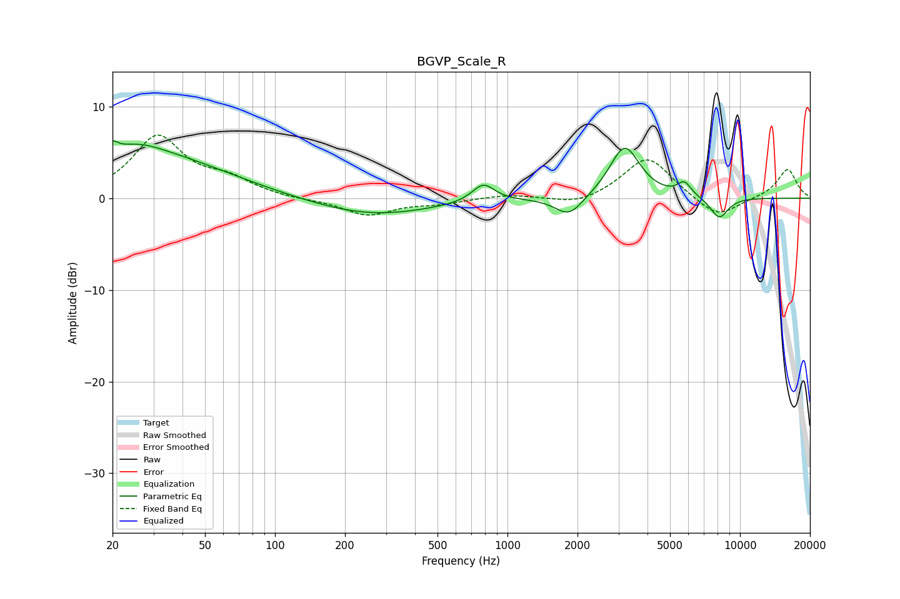

# BGVP_Scale_R
See [usage instructions](https://github.com/jaakkopasanen/AutoEq#usage) for more options and info.

### Parametric EQs
Apply preamp of -6.3 dB when using parametric equalizer.

|   # | Type    |   Fc (Hz) |    Q |   Gain (dB) |
|-----|---------|-----------|------|-------------|
|   1 | Peaking |        20 | 6    |         5.2 |
|   2 | Peaking |        20 | 5.99 |        -4   |
|   3 | Peaking |        25 | 1.33 |         1.3 |
|   4 | Peaking |        29 | 0.43 |         4.6 |
|   5 | Peaking |       260 | 0.55 |        -1.9 |
|   6 | Peaking |       787 | 2.93 |         2   |
|   7 | Peaking |      1844 | 2.34 |        -2.2 |
|   8 | Peaking |      3191 | 2.16 |         5.7 |
|   9 | Peaking |      5764 | 4.67 |         1.5 |
|  10 | Peaking |      8143 | 3.34 |        -2.3 |

### Fixed Band EQs
When using fixed band (also called graphic) equalizer, apply preamp of **-7.0 dB** (if available) and set gains manually with these parameters.

|   # | Type    |   Fc (Hz) |    Q |   Gain (dB) |
|-----|---------|-----------|------|-------------|
|   1 | Peaking |        31 | 1.41 |         6.6 |
|   2 | Peaking |        62 | 1.41 |         1.7 |
|   3 | Peaking |       125 | 1.41 |        -0.2 |
|   4 | Peaking |       250 | 1.41 |        -1.9 |
|   5 | Peaking |       500 | 1.41 |        -0.5 |
|   6 | Peaking |      1000 | 1.41 |         0.4 |
|   7 | Peaking |      2000 | 1.41 |        -0.8 |
|   8 | Peaking |      4000 | 1.41 |         4.6 |
|   9 | Peaking |      8000 | 1.41 |        -2.3 |
|  10 | Peaking |     16000 | 1.41 |         3.2 |

### Graphs

