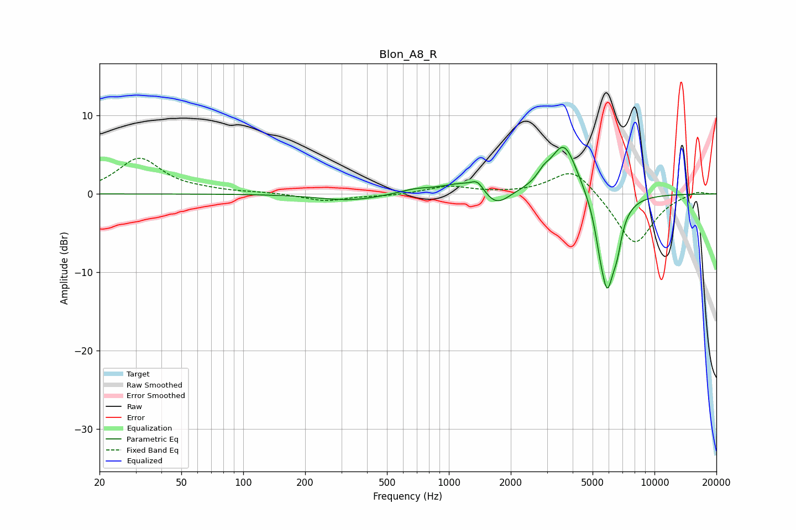

# Blon_A8_R
See [usage instructions](https://github.com/jaakkopasanen/AutoEq#usage) for more options and info.

### Parametric EQs
Apply preamp of -6.0 dB when using parametric equalizer.

|   # | Type    |   Fc (Hz) |    Q |   Gain (dB) |
|-----|---------|-----------|------|-------------|
|   1 | Peaking |       329 | 0.96 |        -0.8 |
|   2 | Peaking |       685 | 1.83 |         0.5 |
|   3 | Peaking |      1162 | 1.41 |         1.4 |
|   4 | Peaking |      1378 | 4.75 |         1.2 |
|   5 | Peaking |      1700 | 2.25 |        -2.1 |
|   6 | Peaking |      2883 | 4.93 |         0.9 |
|   7 | Peaking |      3631 | 2.08 |         6.8 |
|   8 | Peaking |      5416 | 6    |        -1.8 |
|   9 | Peaking |      5888 | 3.62 |       -11.5 |
|  10 | Peaking |      6571 | 5.94 |        -2.8 |

### Fixed Band EQs
When using fixed band (also called graphic) equalizer, apply preamp of **-4.7 dB** (if available) and set gains manually with these parameters.

|   # | Type    |   Fc (Hz) |    Q |   Gain (dB) |
|-----|---------|-----------|------|-------------|
|   1 | Peaking |        31 | 1.41 |         4.5 |
|   2 | Peaking |        62 | 1.41 |         0.3 |
|   3 | Peaking |       125 | 1.41 |         0.2 |
|   4 | Peaking |       250 | 1.41 |        -0.9 |
|   5 | Peaking |       500 | 1.41 |        -0.2 |
|   6 | Peaking |      1000 | 1.41 |         1   |
|   7 | Peaking |      2000 | 1.41 |         0   |
|   8 | Peaking |      4000 | 1.41 |         3.5 |
|   9 | Peaking |      8000 | 1.41 |        -6.6 |
|  10 | Peaking |     16000 | 1.41 |         0.5 |

### Graphs

