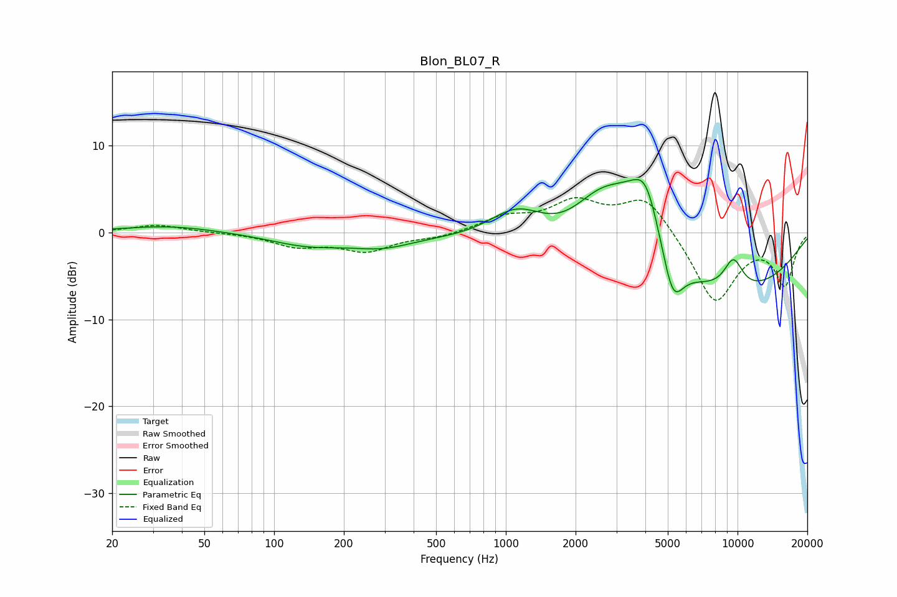

# Blon_BL07_R
See [usage instructions](https://github.com/jaakkopasanen/AutoEq#usage) for more options and info.

### Parametric EQs
Apply preamp of -6.2 dB when using parametric equalizer.

|   # | Type    |   Fc (Hz) |    Q |   Gain (dB) |
|-----|---------|-----------|------|-------------|
|   1 | Peaking |        35 | 0.71 |         0.8 |
|   2 | Peaking |       140 | 0.84 |        -1.4 |
|   3 | Peaking |       293 | 1.08 |        -1.3 |
|   4 | Peaking |      1122 | 1.08 |         4.6 |
|   5 | Peaking |      2536 | 1.03 |         6.1 |
|   6 | Peaking |      3678 | 0.91 |         8.4 |
|   7 | Peaking |      4031 | 2.56 |         4.3 |
|   8 | Peaking |      5249 | 2.93 |        -5.9 |
|   9 | Peaking |      5498 | 0.22 |        -9.2 |
|  10 | Peaking |      9588 | 2.91 |         3.6 |

### Fixed Band EQs
When using fixed band (also called graphic) equalizer, apply preamp of **-4.1 dB** (if available) and set gains manually with these parameters.

|   # | Type    |   Fc (Hz) |    Q |   Gain (dB) |
|-----|---------|-----------|------|-------------|
|   1 | Peaking |        31 | 1.41 |         0.9 |
|   2 | Peaking |        62 | 1.41 |        -0   |
|   3 | Peaking |       125 | 1.41 |        -1.5 |
|   4 | Peaking |       250 | 1.41 |        -2   |
|   5 | Peaking |       500 | 1.41 |        -0.5 |
|   6 | Peaking |      1000 | 1.41 |         1.6 |
|   7 | Peaking |      2000 | 1.41 |         3.3 |
|   8 | Peaking |      4000 | 1.41 |         4.3 |
|   9 | Peaking |      8000 | 1.41 |        -8.2 |
|  10 | Peaking |     16000 | 1.41 |        -5.8 |

### Graphs

