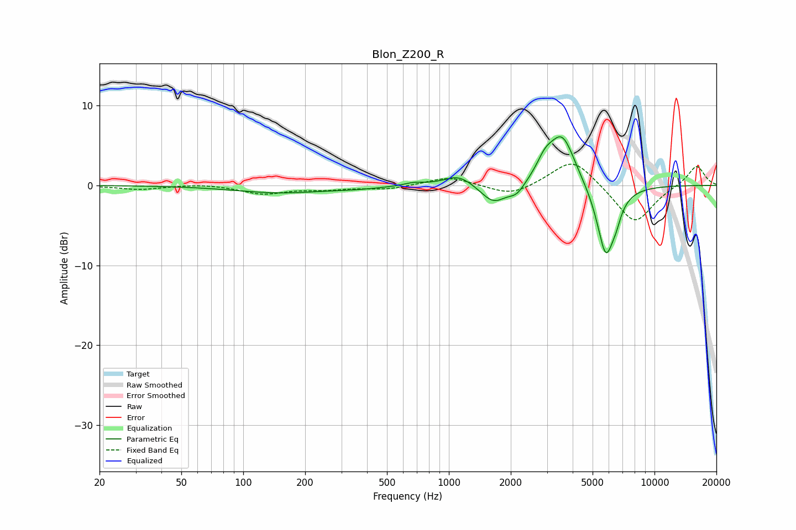

# Blon_Z200_R
See [usage instructions](https://github.com/jaakkopasanen/AutoEq#usage) for more options and info.

### Parametric EQs
Apply preamp of -6.2 dB when using parametric equalizer.

|   # | Type    |   Fc (Hz) |    Q |   Gain (dB) |
|-----|---------|-----------|------|-------------|
|   1 | Peaking |       149 | 0.65 |        -0.9 |
|   2 | Peaking |       358 | 1.11 |        -0.2 |
|   3 | Peaking |       675 | 2.93 |         0.4 |
|   4 | Peaking |      1116 | 2.02 |         1.4 |
|   5 | Peaking |      1650 | 2.27 |        -2.4 |
|   6 | Peaking |      2139 | 3.56 |        -1.3 |
|   7 | Peaking |      2931 | 3.51 |         1.9 |
|   8 | Peaking |      3557 | 2.18 |         6.4 |
|   9 | Peaking |      5801 | 3.1  |        -9.1 |
|  10 | Peaking |      6514 | 5.98 |        -1.2 |

### Fixed Band EQs
When using fixed band (also called graphic) equalizer, apply preamp of **-2.7 dB** (if available) and set gains manually with these parameters.

|   # | Type    |   Fc (Hz) |    Q |   Gain (dB) |
|-----|---------|-----------|------|-------------|
|   1 | Peaking |        31 | 1.41 |        -0.5 |
|   2 | Peaking |        62 | 1.41 |         0.2 |
|   3 | Peaking |       125 | 1.41 |        -1   |
|   4 | Peaking |       250 | 1.41 |        -0.4 |
|   5 | Peaking |       500 | 1.41 |        -0.5 |
|   6 | Peaking |      1000 | 1.41 |         1.1 |
|   7 | Peaking |      2000 | 1.41 |        -1.4 |
|   8 | Peaking |      4000 | 1.41 |         3.5 |
|   9 | Peaking |      8000 | 1.41 |        -4.9 |
|  10 | Peaking |     16000 | 1.41 |         2.6 |

### Graphs

