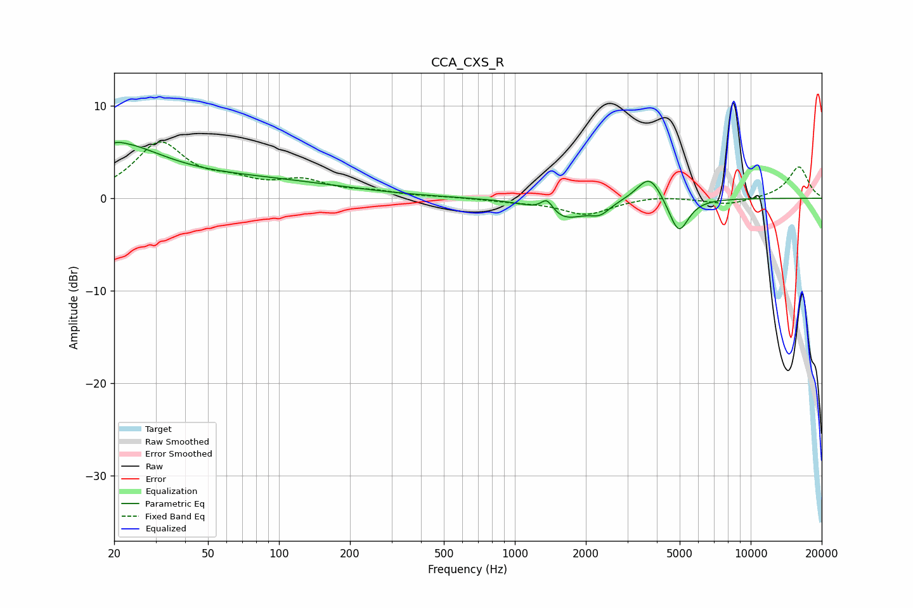

# CCA_CXS_R
See [usage instructions](https://github.com/jaakkopasanen/AutoEq#usage) for more options and info.

### Parametric EQs
Apply preamp of -6.1 dB when using parametric equalizer.

|   # | Type    |   Fc (Hz) |    Q |   Gain (dB) |
|-----|---------|-----------|------|-------------|
|   1 | Peaking |        20 | 0.76 |         5   |
|   2 | Peaking |        20 | 5.87 |        -3   |
|   3 | Peaking |        20 | 5.92 |         3   |
|   4 | Peaking |        51 | 2.05 |        -0   |
|   5 | Peaking |        71 | 0.34 |         1.9 |
|   6 | Peaking |      1369 | 5.36 |         1.5 |
|   7 | Peaking |      1614 | 1.46 |        -2.2 |
|   8 | Peaking |      2300 | 3.43 |        -1.1 |
|   9 | Peaking |      3724 | 2.69 |         2.9 |
|  10 | Peaking |      4952 | 3.37 |        -3.9 |

### Fixed Band EQs
When using fixed band (also called graphic) equalizer, apply preamp of **-6.2 dB** (if available) and set gains manually with these parameters.

|   # | Type    |   Fc (Hz) |    Q |   Gain (dB) |
|-----|---------|-----------|------|-------------|
|   1 | Peaking |        31 | 1.41 |         5.8 |
|   2 | Peaking |        62 | 1.41 |         1.4 |
|   3 | Peaking |       125 | 1.41 |         1.6 |
|   4 | Peaking |       250 | 1.41 |         0.6 |
|   5 | Peaking |       500 | 1.41 |         0.1 |
|   6 | Peaking |      1000 | 1.41 |        -0.3 |
|   7 | Peaking |      2000 | 1.41 |        -1.7 |
|   8 | Peaking |      4000 | 1.41 |         0.3 |
|   9 | Peaking |      8000 | 1.41 |        -0.7 |
|  10 | Peaking |     16000 | 1.41 |         3.4 |

### Graphs

