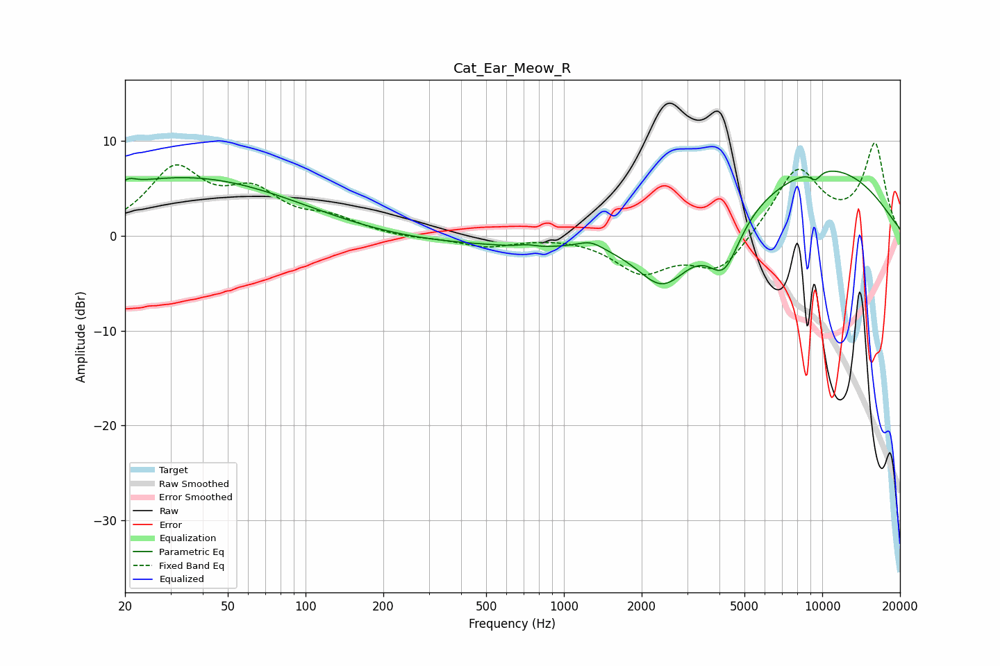

# Cat_Ear_Meow_R
See [usage instructions](https://github.com/jaakkopasanen/AutoEq#usage) for more options and info.

### Parametric EQs
Apply preamp of -6.9 dB when using parametric equalizer.

|   # | Type    |   Fc (Hz) |    Q |   Gain (dB) |
|-----|---------|-----------|------|-------------|
|   1 | Peaking |        21 | 5.3  |         0.6 |
|   2 | Peaking |        35 | 0.32 |         6.2 |
|   3 | Peaking |       410 | 0.29 |        -1   |
|   4 | Peaking |       723 | 3.55 |         0.4 |
|   5 | Peaking |       743 | 1.72 |        -0.4 |
|   6 | Peaking |      1270 | 2.97 |         0.8 |
|   7 | Peaking |      2420 | 1.34 |        -5.8 |
|   8 | Peaking |      4173 | 2.2  |        -5.5 |
|   9 | Peaking |      9407 | 5.96 |        -0.9 |
|  10 | Peaking |      9950 | 0.39 |         7.3 |

### Fixed Band EQs
When using fixed band (also called graphic) equalizer, apply preamp of **-9.9 dB** (if available) and set gains manually with these parameters.

|   # | Type    |   Fc (Hz) |    Q |   Gain (dB) |
|-----|---------|-----------|------|-------------|
|   1 | Peaking |        31 | 1.41 |         6.7 |
|   2 | Peaking |        62 | 1.41 |         4   |
|   3 | Peaking |       125 | 1.41 |         1.5 |
|   4 | Peaking |       250 | 1.41 |        -0.3 |
|   5 | Peaking |       500 | 1.41 |        -1.1 |
|   6 | Peaking |      1000 | 1.41 |         0.1 |
|   7 | Peaking |      2000 | 1.41 |        -3.6 |
|   8 | Peaking |      4000 | 1.41 |        -3.8 |
|   9 | Peaking |      8000 | 1.41 |         7.1 |
|  10 | Peaking |     16000 | 1.41 |         9.5 |

### Graphs

