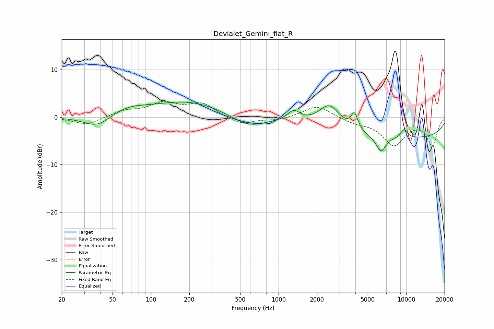

# Devialet_Gemini_flat_R
See [usage instructions](https://github.com/jaakkopasanen/AutoEq#usage) for more options and info.

### Parametric EQs
Apply preamp of -3.3 dB when using parametric equalizer.

|   # | Type    |   Fc (Hz) |    Q |   Gain (dB) |
|-----|---------|-----------|------|-------------|
|   1 | Peaking |        38 | 1.31 |        -2.7 |
|   2 | Peaking |        65 | 0.95 |         1.7 |
|   3 | Peaking |       198 | 0.51 |         3.3 |
|   4 | Peaking |       577 | 1.03 |        -2.5 |
|   5 | Peaking |      1314 | 2.94 |         2.2 |
|   6 | Peaking |      2503 | 1.69 |         4.9 |
|   7 | Peaking |      3936 | 5.31 |         3.4 |
|   8 | Peaking |      6338 | 3.51 |        -3.3 |
|   9 | Peaking |      9407 | 0.19 |        -4.5 |
|  10 | Peaking |      9610 | 4.4  |         1.9 |

### Fixed Band EQs
When using fixed band (also called graphic) equalizer, apply preamp of **-3.4 dB** (if available) and set gains manually with these parameters.

|   # | Type    |   Fc (Hz) |    Q |   Gain (dB) |
|-----|---------|-----------|------|-------------|
|   1 | Peaking |        31 | 1.41 |        -1.7 |
|   2 | Peaking |        62 | 1.41 |         1.2 |
|   3 | Peaking |       125 | 1.41 |         2.7 |
|   4 | Peaking |       250 | 1.41 |         2.7 |
|   5 | Peaking |       500 | 1.41 |        -1.7 |
|   6 | Peaking |      1000 | 1.41 |        -0.7 |
|   7 | Peaking |      2000 | 1.41 |         2.5 |
|   8 | Peaking |      4000 | 1.41 |        -1   |
|   9 | Peaking |      8000 | 1.41 |        -5.7 |
|  10 | Peaking |     16000 | 1.41 |        -5.8 |

### Graphs

