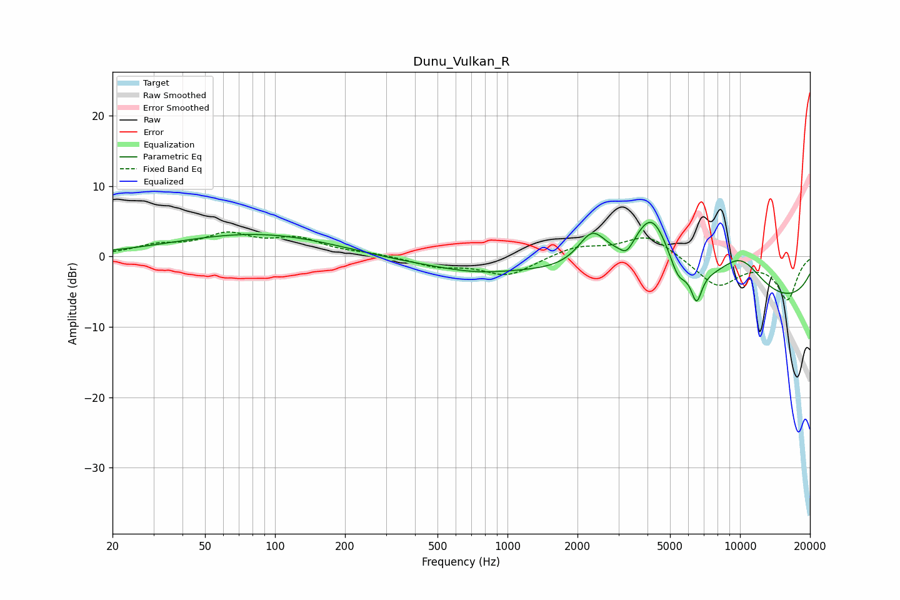

# Dunu_Vulkan_R
See [usage instructions](https://github.com/jaakkopasanen/AutoEq#usage) for more options and info.

### Parametric EQs
Apply preamp of -5.0 dB when using parametric equalizer.

|   # | Type    |   Fc (Hz) |    Q |   Gain (dB) |
|-----|---------|-----------|------|-------------|
|   1 | Peaking |        91 | 0.38 |         3.5 |
|   2 | Peaking |       375 | 0.38 |        -1.2 |
|   3 | Peaking |       745 | 0.84 |        -1.1 |
|   4 | Peaking |      2314 | 2.22 |         5.2 |
|   5 | Peaking |      3259 | 4.79 |        -1.7 |
|   6 | Peaking |      4169 | 1.52 |        10.4 |
|   7 | Peaking |      5407 | 3.9  |        -2.8 |
|   8 | Peaking |      6505 | 6    |        -4.3 |
|   9 | Peaking |     10000 | 0.18 |        -7.3 |
|  10 | Peaking |     10000 | 1.12 |         6   |

### Fixed Band EQs
When using fixed band (also called graphic) equalizer, apply preamp of **-3.6 dB** (if available) and set gains manually with these parameters.

|   # | Type    |   Fc (Hz) |    Q |   Gain (dB) |
|-----|---------|-----------|------|-------------|
|   1 | Peaking |        31 | 1.41 |         1.3 |
|   2 | Peaking |        62 | 1.41 |         2.8 |
|   3 | Peaking |       125 | 1.41 |         2.3 |
|   4 | Peaking |       250 | 1.41 |         0.4 |
|   5 | Peaking |       500 | 1.41 |        -1.3 |
|   6 | Peaking |      1000 | 1.41 |        -2.7 |
|   7 | Peaking |      2000 | 1.41 |         1.4 |
|   8 | Peaking |      4000 | 1.41 |         3.1 |
|   9 | Peaking |      8000 | 1.41 |        -4.2 |
|  10 | Peaking |     16000 | 1.41 |        -6   |

### Graphs

