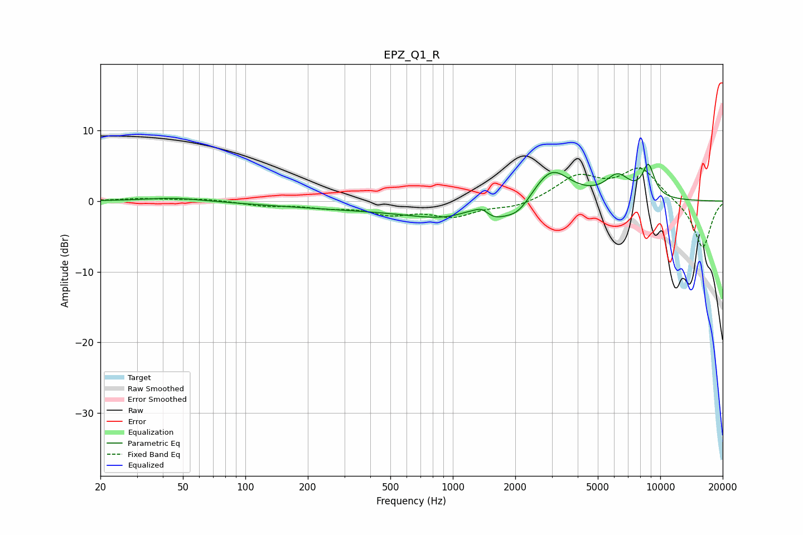

# EPZ_Q1_R
See [usage instructions](https://github.com/jaakkopasanen/AutoEq#usage) for more options and info.

### Parametric EQs
Apply preamp of -5.3 dB when using parametric equalizer.

|   # | Type    |   Fc (Hz) |    Q |   Gain (dB) |
|-----|---------|-----------|------|-------------|
|   1 | Peaking |        45 | 1.04 |         0.5 |
|   2 | Peaking |       330 | 0.35 |        -1   |
|   3 | Peaking |      1049 | 0.67 |        -2.2 |
|   4 | Peaking |      1182 | 2.11 |         0.8 |
|   5 | Peaking |      1383 | 3.88 |         1.1 |
|   6 | Peaking |      1570 | 2.51 |        -1.2 |
|   7 | Peaking |      2055 | 2.2  |        -2   |
|   8 | Peaking |      2976 | 1.55 |         5   |
|   9 | Peaking |      6237 | 2.32 |         3.1 |
|  10 | Peaking |      8767 | 4.38 |         4.4 |

### Fixed Band EQs
When using fixed band (also called graphic) equalizer, apply preamp of **-4.8 dB** (if available) and set gains manually with these parameters.

|   # | Type    |   Fc (Hz) |    Q |   Gain (dB) |
|-----|---------|-----------|------|-------------|
|   1 | Peaking |        31 | 1.41 |         0.3 |
|   2 | Peaking |        62 | 1.41 |         0.3 |
|   3 | Peaking |       125 | 1.41 |        -0.6 |
|   4 | Peaking |       250 | 1.41 |        -0.7 |
|   5 | Peaking |       500 | 1.41 |        -1.6 |
|   6 | Peaking |      1000 | 1.41 |        -2   |
|   7 | Peaking |      2000 | 1.41 |        -0.9 |
|   8 | Peaking |      4000 | 1.41 |         3.4 |
|   9 | Peaking |      8000 | 1.41 |         4.6 |
|  10 | Peaking |     16000 | 1.41 |        -6.8 |

### Graphs

