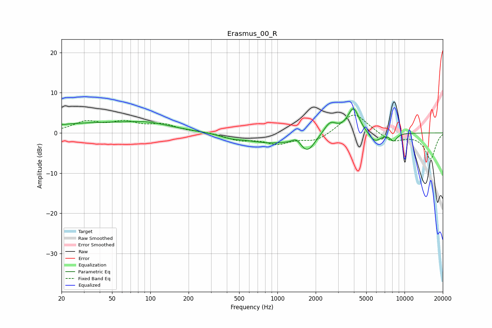

# Erasmus_00_R
See [usage instructions](https://github.com/jaakkopasanen/AutoEq#usage) for more options and info.

### Parametric EQs
Apply preamp of -6.1 dB when using parametric equalizer.

|   # | Type    |   Fc (Hz) |    Q |   Gain (dB) |
|-----|---------|-----------|------|-------------|
|   1 | Peaking |        43 | 0.28 |         2.5 |
|   2 | Peaking |        96 | 1.05 |         0.8 |
|   3 | Peaking |       425 | 1.77 |        -0.6 |
|   4 | Peaking |       876 | 0.67 |        -2.4 |
|   5 | Peaking |      1412 | 4.21 |         1.4 |
|   6 | Peaking |      1722 | 2.42 |        -3.9 |
|   7 | Peaking |      2592 | 2.76 |         3.1 |
|   8 | Peaking |      3966 | 3.05 |         6.3 |
|   9 | Peaking |      5824 | 2.87 |        -2.5 |
|  10 | Peaking |      8214 | 5    |        -1.8 |

### Fixed Band EQs
When using fixed band (also called graphic) equalizer, apply preamp of **-4.5 dB** (if available) and set gains manually with these parameters.

|   # | Type    |   Fc (Hz) |    Q |   Gain (dB) |
|-----|---------|-----------|------|-------------|
|   1 | Peaking |        31 | 1.41 |         2.6 |
|   2 | Peaking |        62 | 1.41 |         2.3 |
|   3 | Peaking |       125 | 1.41 |         1.9 |
|   4 | Peaking |       250 | 1.41 |         0.2 |
|   5 | Peaking |       500 | 1.41 |        -1.6 |
|   6 | Peaking |      1000 | 1.41 |        -2.4 |
|   7 | Peaking |      2000 | 1.41 |        -2   |
|   8 | Peaking |      4000 | 1.41 |         5.2 |
|   9 | Peaking |      8000 | 1.41 |        -2.2 |
|  10 | Peaking |     16000 | 1.41 |        -6.5 |

### Graphs

