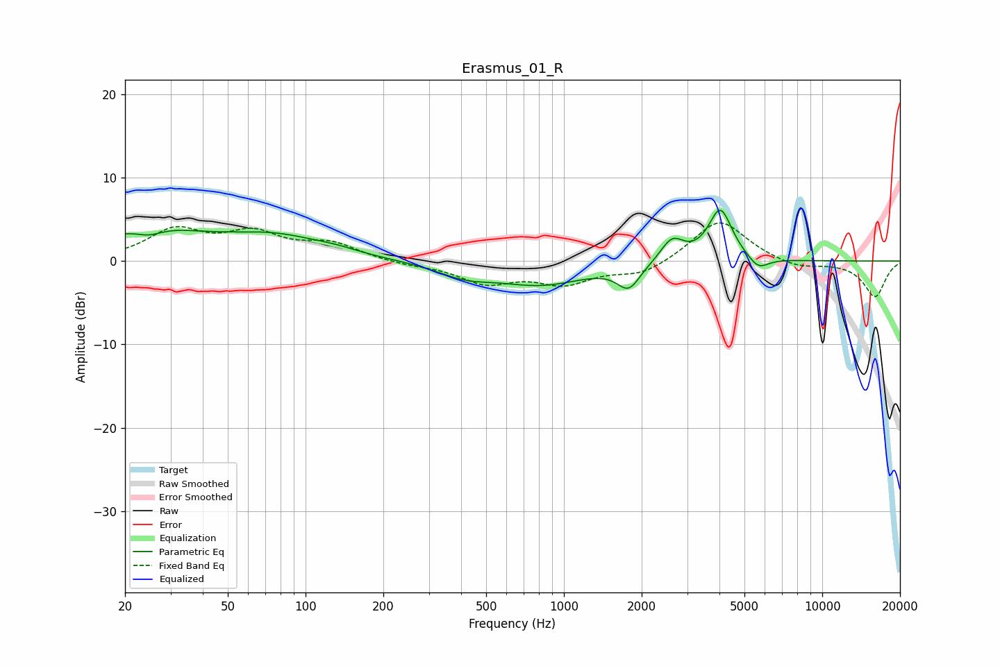

# Erasmus_01_R
See [usage instructions](https://github.com/jaakkopasanen/AutoEq#usage) for more options and info.

### Parametric EQs
Apply preamp of -6.2 dB when using parametric equalizer.

|   # | Type    |   Fc (Hz) |    Q |   Gain (dB) |
|-----|---------|-----------|------|-------------|
|   1 | Peaking |        24 | 0.67 |         3.6 |
|   2 | Peaking |        25 | 2.73 |        -0.9 |
|   3 | Peaking |        76 | 0.72 |         2.6 |
|   4 | Peaking |       132 | 1.64 |         0.4 |
|   5 | Peaking |       412 | 1.31 |        -1.4 |
|   6 | Peaking |       819 | 0.78 |        -2.7 |
|   7 | Peaking |      1782 | 3.23 |        -2.8 |
|   8 | Peaking |      2624 | 3.12 |         2.8 |
|   9 | Peaking |      4031 | 3.06 |         6.2 |
|  10 | Peaking |      5657 | 3.57 |        -1.5 |

### Fixed Band EQs
When using fixed band (also called graphic) equalizer, apply preamp of **-4.7 dB** (if available) and set gains manually with these parameters.

|   # | Type    |   Fc (Hz) |    Q |   Gain (dB) |
|-----|---------|-----------|------|-------------|
|   1 | Peaking |        31 | 1.41 |         3.5 |
|   2 | Peaking |        62 | 1.41 |         3   |
|   3 | Peaking |       125 | 1.41 |         1.9 |
|   4 | Peaking |       250 | 1.41 |        -0.4 |
|   5 | Peaking |       500 | 1.41 |        -2.5 |
|   6 | Peaking |      1000 | 1.41 |        -2.4 |
|   7 | Peaking |      2000 | 1.41 |        -1.6 |
|   8 | Peaking |      4000 | 1.41 |         5.1 |
|   9 | Peaking |      8000 | 1.41 |        -0.9 |
|  10 | Peaking |     16000 | 1.41 |        -4.3 |

### Graphs

