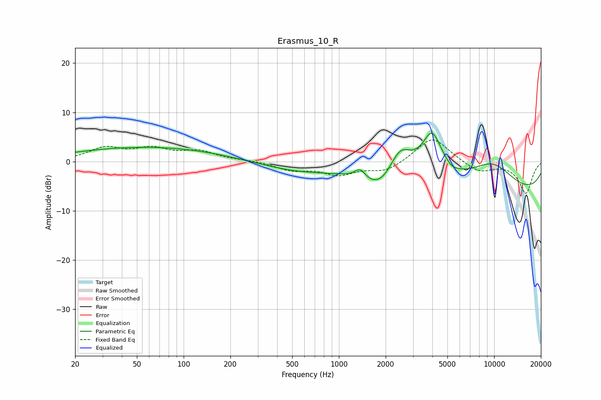

# Erasmus_10_R
See [usage instructions](https://github.com/jaakkopasanen/AutoEq#usage) for more options and info.

### Parametric EQs
Apply preamp of -5.8 dB when using parametric equalizer.

|   # | Type    |   Fc (Hz) |    Q |   Gain (dB) |
|-----|---------|-----------|------|-------------|
|   1 | Peaking |        59 | 0.28 |         2.9 |
|   2 | Peaking |       473 | 0.63 |         0.3 |
|   3 | Peaking |       532 | 0.57 |        -2.2 |
|   4 | Peaking |      1370 | 4.02 |         2   |
|   5 | Peaking |      1851 | 1.3  |        -4.2 |
|   6 | Peaking |      2476 | 1.82 |         6.6 |
|   7 | Peaking |      3983 | 2.03 |         9.5 |
|   8 | Peaking |      5317 | 4.2  |        -0.6 |
|   9 | Peaking |      9647 | 0.79 |         6.3 |
|  10 | Peaking |     10000 | 0.18 |        -7.3 |

### Fixed Band EQs
When using fixed band (also called graphic) equalizer, apply preamp of **-4.5 dB** (if available) and set gains manually with these parameters.

|   # | Type    |   Fc (Hz) |    Q |   Gain (dB) |
|-----|---------|-----------|------|-------------|
|   1 | Peaking |        31 | 1.41 |         2.6 |
|   2 | Peaking |        62 | 1.41 |         2.3 |
|   3 | Peaking |       125 | 1.41 |         1.9 |
|   4 | Peaking |       250 | 1.41 |         0.2 |
|   5 | Peaking |       500 | 1.41 |        -1.6 |
|   6 | Peaking |      1000 | 1.41 |        -2.4 |
|   7 | Peaking |      2000 | 1.41 |        -2   |
|   8 | Peaking |      4000 | 1.41 |         5.2 |
|   9 | Peaking |      8000 | 1.41 |        -2.2 |
|  10 | Peaking |     16000 | 1.41 |        -6.4 |

### Graphs

